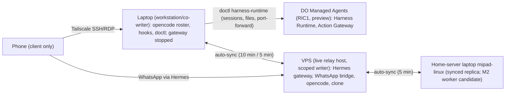

# Host Topology and Switch Runbook (HOSTS.md)

- Date: 2026-09-23
- Status: Phase 4 in progress. The VPS is the live relay host (M1 complete, ADR-026); the laptop remains the hub and a workstation/co-writer. DigitalOcean Managed Agents is an approved managed execution host (ADR-019), gated.
- Scope: host classes, topology, credential boundaries, bootstrap, authority, switch/failover, readiness, and remote access.
- Related: spec Sections 4 and 10; ADR-011 through ADR-026; the Phase 4 research doc.

## 1. Topology Overview

The VPS is the live relay host (M1 complete 2026-09-25, ADR-026) and a repo-scoped writer; the laptop remains a workstation/co-writer. DO sessions are disposable execution and never hold authority; there is no inbound connectivity to DO. The phone is a client only. Node trees converge through the ADR-025 auto-sync.

The owner approved a decoupled topology on 2026-09-23 (ADR-019 amendment): the relay moved to a plain droplet/VPS (Tailscale + systemd, flat cost) for availability, while DO Managed Agents is used only as a sandboxed worker after the Phase 4 gate set passes. A preview failure on DO cannot take the relay down.

## 2. Host Classes

| Host | Class | What runs there | Authority | Access path | Current status |
| :--- | :--- | :--- | :--- | :--- | :--- |
| Laptop | Workstation, self-hosted | opencode with the 7-agent roster; git hooks; doctl; Tailscale; OpenSSH (installed, stopped; SSH deferred per ADR-020); RDP (RDP scoped to the Tailscale interface). Hermes gateway stopped; the local WhatsApp session copy is retained as rollback | Workstation/co-writer; relay authority moved to the VPS | Local console; Tailscale SSH/RDP from the phone | Active; relay moved off it (gateway stopped) |
| DO Managed Agents | Managed execution host (ADR-019) | Harness Runtime sessions (Stage A planned); Action Gateway MCP (Stage B live) | None; sessions are disposable | doctl and relay dispatch; no inbound; port-forward for dashboards | Stage B proven (connectivity only); Stage A blocked until the Phase 4 gate set passes (Section 9); sandboxed worker only; RIC1; preview terms |
| VPS | Live relay host (decoupled decision); scoped writer | Hermes gateway (systemd user service, linger enabled) + WhatsApp bridge (bot mode) + opencode 1.18.32 (`opencode-go` auth) + workspace clone at `~/naquuuu` | Holds relay authority; repo-scoped write via ed25519 deploy key ("vps-relay (M1)") | Tailscale; SSH key-only | Live (Tencent Cloud Lighthouse, 2 vCPU / 2 GB / 40 GB, Singapore, Ubuntu 24.04 LTS); WhatsApp tasks verified end-to-end; see `internal-docs/relay/VPS_RELAY_RUNBOOK.md` |
| Home-server laptop (`mipad-linux`) | Synced replica; M2 worker candidate | opencode 1.18.32; workspace clone; auto-sync (systemd user timer, 5 min); Tailscale; i5-8250U / 8 GB RAM / 219 GB NVMe, Ubuntu 24.04 | None today (replica; no relay) | Tailscale | Onboarded; owner follow-ups pending (`opencode auth login`, reboot) |
| Phone | Client only | WhatsApp; Tailscale client for SSH/RDP | None; never holds runtime authority | WhatsApp via Hermes; Tailscale SSH/RDP to the laptop | In use |

## 3. Credential and Data Boundaries

| Boundary | Rule |
| :--- | :--- |
| Tier 1 material (keys, passwords, phone numbers, session tokens, unreleased private source) | Never enters any model context; never runs on DO sessions. Tier 1 routes through the personal GCP project (Gemini paid no-train / Vertex AI) per AGENTS.md Critical Rule 3 (amended by ADR-019). |
| Hub `.env` | Never uploaded to any host or session; read locally only. Holds the DO API token as `DIGITALOCEAN_ACCESS_TOKEN` (Tier 1). |
| DO API token | Tier 1; lives only in hub `.env`; no `%APPDATA%\doctl\config.yaml` exists; never in chat or the repo. |
| MCP URL and OAuth tokens | Machine-local only: the global opencode config `~/.config/opencode/opencode.jsonc` (action-gateway entry) and `~/.local/share/opencode/mcp-auth.json`; outside the repo; live session URLs are never written to docs. |
| VPS provider keys | The VPS gets its own provider key in the host env, never in the repo (spec Phase 4 prerequisite). |
| WhatsApp pairing | Owner-private; never enters model context; re-pair with the dedicated number on the VPS only if the copied session is rejected. |
| DO sessions | Tier 2/3 workspace content only; no hub `.env`, no Tier 1 material. |
| Gates and writes | Sanitization, commit, and push stay local and are never re-hosted; no writes to the hub or child repos from Stage A or B until a commit/push policy exists for DO hosts (ADR-019). |

## 4. Bootstrap per Host

### 4.1 Laptop (current)

1. Set `NAQUUUU_WORKSPACE` (Windows) or `$NAQUUUU_WORKSPACE` (Linux) in the host env; hub `.env` carries the shared values.
2. Hooks: confirm `core.hooksPath=.githooks` with `pre-commit` and `pre-push` present; run `python scripts/verify_sanitization.py` (today: PASS).
3. opencode: confirm the 7-agent roster and the model pins in `opencode.jsonc`.
4. Hermes: install at `%LOCALAPPDATA%\hermes`; start the gateway; keep WhatsApp pairing owner-private.
5. doctl: 1.171.0 via winget; token read from hub `.env` as `DIGITALOCEAN_ACCESS_TOKEN`; no doctl config file.
6. Readiness: `python scripts/host_check.py`; expect RESULT READY.

### 4.2 DigitalOcean Managed Agents

1. doctl present; token via the env var (`DIGITALOCEAN_ACCESS_TOKEN` from hub `.env`), never via `doctl auth init` config.
2. Balance gate: `doctl harness-runtime balance` shows Status OK; auto top-off off; the prepaid balance is the hard stop.
3. Session creation: the session policy is fixed at creation ("Session configuration is set at creation."); the live Stage B session uses Default Action Allow, and it must be tightened to read-only allow / writes ask before Stage C.
4. Provider connections: authorize per provider as needed (one `droplet:read` connection authorized today); credentials are brokered at execution time and never enter the sandbox.
5. Per-client OAuth: `opencode mcp auth action-gateway` (verified 2026-09-23); tokens at `~/.local/share/opencode/mcp-auth.json`.
6. Config: the action-gateway MCP entry lives only in the machine-local global config; never upload `.env`; never commit the config.
7. Constraints: RIC1 only; no inbound connections; port-forward for dashboards; preview terms (no SLA, no durability guarantees, termination at will).

### 4.3 VPS (executed — live relay host, per spec Phase 4 step 2)

Status: executed 2026-09-25 (M1 complete, ADR-026). Execution runbook: `internal-docs/relay/VPS_RELAY_RUNBOOK.md` (M1 execution details and gotchas live there; supersedes this list where they differ).

1. Provision opencode + Hermes on the VPS.
2. Clone the runtime workspace.
3. Provider auth; Hermes gets its own provider key in the host env (never in the repo).
4. Run `opencode serve` bound to loopback/Tailscale with `OPENCODE_SERVER_PASSWORD`.
5. Run the Hermes gateway under systemd (user service; linger enabled).
6. Move the WhatsApp session from the laptop (laptop copy retained as rollback); re-pair only if the copied session is rejected.
7. Run the readiness checks, then a switch drill (Section 5).

## 5. Authority and Switches

### 5.1 Authority model

- The VPS holds relay authority (live relay host) and is a scoped writer (repo-scoped deploy key); the laptop remains a workstation/co-writer.
- DO sessions are disposable and never hold authority.
- Commits stay gate-protected: auto-sync runs `scripts/verify_sanitization.py` before commit and push (ADR-025); gates are never re-hosted to DO.
- One WhatsApp bridge at a time (after `hermes gateway stop`, verify port 3000 is free before starting another host).
- One writer per tree (Standing Rule 1, amended by ADR-025: nodes converge through auto-sync, one thread at a time); commit at every IDE handoff.

### 5.2 Switch procedure (spec Phase 4)

1. Stop the gateway on the active host.
2. Ensure its tree is committed and pushed (the hooks guarantee gates).
3. On the standby: pull, run `host_check.py` (`host_check.py` refuses local dev when the active tree is dirty or ahead, per spec Phase 4 step 3), start the gateway; re-pair WhatsApp only if the copied session is rejected.
4. Verify with a phone "hello" plus one repo-status question before declaring the switch done.
5. Run one deliberate drill in both directions (VPS to laptop and back) before declaring the topology settled (spec Phase 4 step 4).

### 5.3 DO note

Stopping the gateway does not affect DO sessions; only the relay target changes. DO has no inbound connections and holds no authority.

### 5.4 Failover drill checklist (both directions: VPS to laptop and back)

- [ ] Active host tree committed and pushed.
- [ ] Standby pulled and `host_check.py` READY.
- [ ] Gateway stopped on the active host and started on the standby.
- [ ] Phone "hello" answered.
- [ ] One repo-status question answered.
- [ ] Drill result logged.
- [ ] Drill run in both directions.

## 6. Readiness Checks

### 6.1 Current checks in `scripts/host_check.py`

| Check | What it verifies | Snapshot 2026-09-23 |
| :--- | :--- | :--- |
| (a) hub tree | hub `git status` clean (WARN when dirty) | WARN at snapshot: `scripts/setup_remote_access.ps1` (then untracked; now tracked) |
| (b) hermes install | install present at `%LOCALAPPDATA%\hermes` | PASS |
| (c) gateway singleton | `hermes gateway status` reports running | PASS |
| (d) bridge singleton | the bridge PID maps to a live process | PASS |
| (e) bridge mode drift | bridge log mode matches `WHATSAPP_MODE` | PASS |
| (f) effective config | `WHATSAPP_ENABLED`, `WHATSAPP_MODE`, `WHATSAPP_ALLOWED_USERS` present and non-empty | PASS |

Snapshot 2026-09-23: `SUMMARY: 5 PASS, 1 WARN, 0 FAIL`, `RESULT: READY (with warnings)`. The WARN was the then-untracked `scripts/setup_remote_access.ps1`, now tracked; the hub-tree check warns whenever the tree is dirty, including documentation edits.

### 6.2 Phase 4 additions (planned)

- DO readiness checks: doctl present; `doctl harness-runtime balance` gate status OK; token presence without printing values.

## 7. Remote Access State (Phase 3D)

| Component | State | Todo |
| :--- | :--- | :--- |
| Tailscale | Installed | None |
| OpenSSH Server | Installed; service Stopped (SSH path not active) | SSH deferred (ADR-020); fallbacks are the Win32-OpenSSH release or Tailscale built-in SSH (`tailscale set --ssh` plus a tailnet ACL rule) |
| RDP | Enabled (`fDenyTSConnections=0`); scoped to the Tailscale interface via the custom `NAQUUUU RDP (Tailscale)` rule (port 3389 TCP; built-in wide Remote Desktop rules disabled); NLA off because the account is Azure AD (`UserAuthentication=0`); verified live from the phone (ADR-020) | None; keep the tailnet ACLs tight |
| Phone access | WhatsApp via Hermes; Tailscale for SSH/RDP to the laptop | Keep the phone client-only |

## 8. References

- `internal-docs/specs/2026-09-22-agent-subagent-architecture.md`, Sections 4 and 10.
- `internal-docs/DECISION_LOG.md`, ADR-011 through ADR-026.
- `internal-docs/research/2026-09-23-do-managed-agents-phase4.md`.
- `internal-docs/relay/README.md`.
- `internal-docs/AGENT_PLAYBOOK.md`.
- `scripts/setup_remote_access.ps1` (tracked; captures the remote-access setup with transcript logging).

## 9. Phase 4 Gate Set (five-review panel, 2026-09-23)

Five independent adversarial reviews (Opus 4.6, 3.8 Flash High, 3.1 Pro High, Muse Spark 1.3, Big Pickle) reviewed the Stage B evidence. Consensus: STOP before Stage A; Stage B proved connectivity, not controls. Stage A is blocked until all gates pass with evidence.

| Gate | Requirement | Status |
| :--- | :--- | :--- |
| 1 | Deny-default session created and a forbidden call demonstrably rejected platform-side; tool list pinned; meta-tool discovery disabled | Documented as supported; console probe pending |
| 2 | Enforcement locus confirmed (platform-enforced, not advisory) | Pending |
| 3 | Token scope inventory + revocation drill + storage without env-var/argv exposure + separate admin/agent identity | Pending |
| 4 | Model backend verified (which model sessions call; key pinnable) | Pending |
| 5 | Spend controls: autorecharge OFF (recorded), card cap, threshold alerts, billing-lag re-measure, relay turn/time budgets, kill switch reachable without the laptop | Partially recorded |
| 6 | Server-side no-push backstop (branch protection) + IAM minimality + egress allowlist + WhatsApp/fetch egress scanning; client-side deny rules are defense-in-depth only | Pending |
| 7 | Insights opt-out verified before any data transits | Pending |
| 8 | Ingestion gate: DO artifacts treated as untrusted patches; manual review + sanitization before the laptop tree; no auto-pull | Policy recorded; enforcement pending |

Stage 0 (zero-cost probes) is approved and in progress. No triggers or schedules may exist in Stages A/C.
