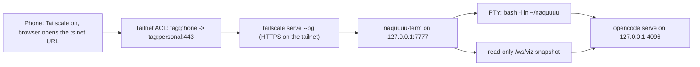

# NQ Term Runbook (phone-side VPS access)

- Purpose: install `naquuuu-term` on the relay VPS, expose it over the tailnet, and reach a real shell from the phone — so the owner has an out-of-band recovery path when WhatsApp is down.
- Status: authored 2026-09-28 from source. **Not executed.** Deployment is owner-run (ADR-032, Accepted, deployment pending). Every command below is read from `projects/naquuuu-term/scripts/install-systemd.sh` and the server modules, not from a live host.
- Related: `internal-docs/HOSTS.md` §4.3, §7; `internal-docs/TAILSCALE_ACL.md` §3, §4; `internal-docs/relay/VPS_RELAY_RUNBOOK.md`; `internal-docs/DECISION_LOG.md` ADR-020, ADR-026, ADR-032; `projects/naquuuu-term/README.md`; `projects/naquuuu-term/scripts/install-systemd.sh`.
- Scope: one app on the existing relay host — install, expose, verify, troubleshoot, update, remove.
- Non-goals: re-provisioning the VPS; authoring the tailnet policy (this runbook *specifies* the one grant it needs and does not apply it); phone SSH (still deferred, ADR-020); choosing a git remote for the project (owner decision, ADR-032); any code change in `projects/naquuuu-term`.

## Hard prerequisites

1. **The shared `opencode serve` on loopback is REQUIRED for the agents visualiser.** A TUI running inside the PTY owns a private server on a random port, so nothing outside that process can see its session tree. The deployment is therefore `opencode serve --hostname 127.0.0.1 --port 4096` observed by the app, plus `opencode attach http://127.0.0.1:4096` typed in the terminal. Without it the terminal and workspace tabs work normally and the agents tab is empty **by design** — the app says so instead of drawing a fabricated world (ADR-032 §2, §7).
2. **Phone SSH is still deferred, so this is the recovery path ADR-020 left open.** `HOSTS.md` §7 records phone SSH as deferred; `VPS_RELAY_RUNBOOK.md` (Security notes) documents a kill switch as "tailnet SSH → `hermes gateway stop`", which no phone could actually run. This app closes that gap: the same command, typed into a terminal on the phone, with no SSH, no keys and no stored password. Do not re-open phone SSH because of it.



## Step 0 — Prerequisites

Check each one as the relay user, in an interactive login shell. The installer checks `node` and the project directory, and assumes the rest.

```bash
node --version           # needs >= 20 (package.json engines)
command -v node          # the script exits "node is required" without this
command -v opencode      # NOT checked by the script, and the unit depends on it
loginctl show-user "$(id -un)" -p Linger    # expect Linger=yes
```

- Build toolchain for the native PTY module: `sudo apt install -y build-essential python3`. `node-pty` compiles; without a compiler the install still "succeeds" and the terminals do not start (see Troubleshooting B).
- The relay host already has Tailscale, UFW, opencode, Hermes and the clone at `~/naquuuu` (`VPS_RELAY_RUNBOOK.md` Steps 1–4). This runbook adds nothing to the firewall.
- Decide who owns port 4096 **before** installing. The relay already attaches to a warm server on that port (`VPS_RELAY_RUNBOOK.md` Appendix, relay skill block; `M2_DISPATCH_RUNBOOK.md` env table, `OPENCODE_ATTACH`; `RELAY_PLAN.md` §1). If something is already listening there, stop it or point the app at it; the new unit will restart-loop otherwise. Check without printing anything sensitive:

```bash
sh ~/naquuuu/scripts/enable_gates.sh --check | grep '^serve:'   # --check changes nothing; never prints a value
ss -ltnp | grep -E '7777|4096' || echo "neither port bound yet"
```

`serve: an 'opencode serve' process exists` means something already holds the port. Export `NAQUUUU_OPENCODE_SERVE_PORT` in your shell to make the script probe loopback too; the script never prints the value.

## Step 1 — Clone

There is **no remote for this repository yet** (ADR-032, local-only pending the owner's decision), so `git clone` from a URL does not work today. Either add the remote first, or copy the tree over Tailscale from the machine that holds it:

```bash
scp -r <local path>/naquuuu-term <relay-user>@<relay node>:~/
```

If a remote exists:

```bash
git clone <project remote> ~/naquuuu-term
cd ~/naquuuu-term
```

## Step 2 — Install (as the relay user, not root)

```bash
cd ~/naquuuu-term
bash scripts/install-systemd.sh
```

**Run it as the relay user.** The script uses `$HOME` for the unit directory, the env file and the linger call, and resolves `node` and `opencode` from your current `PATH`. Under `sudo` it would install a second copy of everything into `/root`, and no service would come up on the host that matters.

Optional pre-flight: `npm test` (covers tag normalisation, constant-time token comparison, and the secret-exclusion rule).

### What the script does, in order

1. Resolves `PROJECT_DIR` (`$HOME/naquuuu-term`), `NQ_PORT` (7777), `OPENCODE_PORT` (4096), the unit dir and the env file path. Exits if `node` is absent or the project dir is missing.
2. `mkdir -p ~/.config/systemd/user ~/.config/naquuuu-term/env.d ~/.config/naquuuu-term`.
3. `npm install --omit=dev --no-audit --no-fund` — installs `ws` and, optionally, `node-pty`.
4. `npm install --no-save @xterm/xterm @xterm/addon-fit` — the two packages omitted in step 3; `--no-save` leaves `package.json` untouched.
5. `npm run vendor` — copies three xterm UMD builds into `public/vendor/xterm/` so the app makes no third-party request at runtime. Exits 1 if a source file is missing.
6. Writes both unit files (below).
7. Writes `~/.config/naquuuu-term/env` (mode 600) **only if it does not already exist**; otherwise leaves it alone.
8. `loginctl enable-linger "$(id -un)"`.
9. `systemctl --user daemon-reload`, then `enable --now` for `opencode-serve.service` and `naquuuu-term.service`, in that order.
10. Prints a two-unit status summary, then the `tailscale serve` and ACL reminders.

### The two units

| Field | `naquuuu-term.service` | `opencode-serve.service` |
| :--- | :--- | :--- |
| `After` / `Wants` | `network-online.target opencode-serve.service` / `opencode-serve.service` | `network-online.target` |
| `EnvironmentFile` | `~/.config/naquuuu-term/env` (required, no `-` prefix) | same |
| `WorkingDirectory` | `~/naquuuu-term` | `~/naquuuu-term/..` (the home dir) |
| `ExecStart` | `<absolute path to node> ~/naquuuu-term/server/index.js` | `<absolute path to opencode> serve --hostname 127.0.0.1 --port 4096` |
| `Restart` | `always`, `RestartSec=3` | `always`, `RestartSec=5` |
| Output | journal | journal |
| Installed into | `default.target` | `default.target` |

Two properties worth knowing before you touch either file: the `node` and `opencode` paths are **baked in at install time** from your `PATH`, and `WorkingDirectory` for the opencode unit is the parent of the clone, not the clone.

### The env file

Written on first install, mode 600, host-only. With defaults substituted it reads:

```bash
NQ_HOST=127.0.0.1
NQ_PORT=7777
NQ_CWD=<home>/naquuuu
NQ_SHELL=/bin/bash
NQ_AUTH_MODE=auto
NQ_REQUIRED_TAG=tag:phone
# NQ_AUTH_TOKEN=<random>            # local-dev fallback only
OPENCODE_URL=http://127.0.0.1:4096
# OPENCODE_SERVER_PASSWORD=<random> # set if opencode serve is password protected
```

- Tier 1 material lives here and only here, never in the repo (AGENTS.md Model-Input Boundary). `HOSTS.md` §4.3 step 4 expects the warm server to be password-protected; if you set that password, put the same value on this line, or every visualiser API call fails and the agents tab stays offline.
- Other knobs the app reads, with their defaults: `NQ_MAX_SESSIONS=4`, `NQ_SESSION_IDLE_MS=21600000` (6 h), `NQ_LOG_REQUESTS=false`, `NQ_TAILSCALE_SOCKET` (defaults to `/var/run/tailscale/tailscaled.sock` on Linux), `OPENCODE_SERVER_USERNAME=opencode`.
- Edit then reload: `systemctl --user restart naquuuu-term.service opencode-serve.service`.

## Step 3 — Expose over the tailnet

```bash
tailscale serve --bg http://127.0.0.1:7777
tailscale serve status
```

- `--bg` persists across reboot and `tailscale down`/`up`. The status output shows the served path and the `*.ts.net` name; record the name, do not paste it into chat.
- **Never `tailscale funnel`.** Funnel would publish to the open internet a host that holds relay authority and a repo-scoped deploy key (ADR-032 §6). If `tailscale serve status` ever shows a funnel line, turn it off immediately.
- No firewall change: the app binds loopback, Serve terminates TLS on the tailnet, and UFW keeps allowing TCP 22 plus `tailscale0` only.

## Step 4 — The one ACL grant

Without this the phone is refused at the TCP layer before the app ever sees a request. Add exactly this rule to the `acls` array in `internal-docs/TAILSCALE_ACL.md` §3:

```jsonc
{
  "action": "accept",
  "src": ["tag:phone"],
  "dst": ["tag:personal:443"]
}
```

- One grant only. It does not open 443 to work machines: they stay untagged, so default-deny still applies to them, and this rule is scoped to the phone tag and the personal-tagged hosts.
- It assumes the phone already carries `tag:personal,tag:phone` and the relay host carries `tag:personal` (`TAILSCALE_ACL.md` §4 step 2). If the phone is untagged, retag it in the same change.
- The policy in `TAILSCALE_ACL.md` is still **drafted, not applied**. Until the owner applies the whole file, nothing in this runbook is reachable from the phone regardless of the grant.
- Validate in the console ACL tester before trusting it: phone → relay:443 expect accept; work machine → relay:443 expect deny.

## Step 5 — Use it from the phone

1. Turn Tailscale on in the phone app and wait for the node to connect.
2. Open the `*.ts.net` URL in the phone browser. You should land straight in the terminal — no token prompt (if you see one, go to Troubleshooting D).
3. Add it to the home screen:
   - iOS / Safari: Share, then **Add to Home Screen**.
   - Android / Chrome: the three-dot menu, then **Add to Home screen** (or **Install app** when offered).
   The app ships a web manifest with `display: standalone` and the iOS web-app meta tags, so the icon launches full-screen with no address bar. An HTTPS launch also registers a service worker, which caches the static shell only — never `/ws` or `/api/`, so a cached terminal frame cannot happen.
4. Inside the app, three tabs:
   - **terminal** — a real PTY running `bash -l` in `~/naquuuu`. The key bar below the screen sends `esc`, `tab`, `ctrl`, arrows, `^c`, `^d`, `^z` and `/ | - ~`, plus a paste button. Start here: `pwd`, then `opencode attach http://127.0.0.1:4096` so the agents tab shows the sessions you start.
   - **agents** — the live session world. Quiet when nothing runs; that is correct, not broken.
   - **workspace** — host, cwd, `PATH`, git state and a shallow tree. Tap a folder to see it, refresh for a new snapshot.
5. Kill switch: `hermes gateway stop` in the terminal. The relay comes back with `systemctl --user start hermes-gateway.service` or `hermes gateway start`.

## Step 6 — Verification checklist

Run 1–5 on the relay host, 6–11 from the phone, 12–13 anywhere.

- [ ] 1. `systemctl --user is-active naquuuu-term.service opencode-serve.service` → `active` twice.
- [ ] 2. `curl -s http://127.0.0.1:7777/api/health` → `{"ok":true,"pty":{"available":true},"sessions":0}`. This endpoint is deliberately unauthenticated and is the liveness probe.
- [ ] 3. `journalctl --user -u naquuuu-term.service -n 20 --no-pager` shows all five boot lines: `listening on http://127.0.0.1:7777`, the `shell:`/`cwd:` line, `auth:  mode=auto requiredTag=tag:phone`, `pty:   ready`, and `viz:   opencode <version> on http://127.0.0.1:4096`.
- [ ] 4. `ss -ltnp | grep -E '7777|4096'` → both bound on loopback only, never on all interfaces.
- [ ] 5. `tailscale serve status` → the proxy target `http://127.0.0.1:7777` and the served name, with no funnel line.
- [ ] 6. Phone: the URL opens the terminal with no token gate and no certificate warning.
- [ ] 7. Auth proof, from any tailnet peer: `curl -i https://<the served name>/api/ping` → `200` with body `{"ok":true,"via":"tailscale-tag"}`. `via: tailscale-tag` is the only acceptable proof. `via: token` means the request was treated as loopback local dev.
- [ ] 8. Negative, from an untagged work machine: the same URL is refused at the connection, never answered with `200`. A refusal is enough; do not run destructive tests.
- [ ] 9. Terminal: `pwd` prints the clone path, `echo $TERM` prints `xterm-256color`, `opencode attach http://127.0.0.1:4096` attaches.
- [ ] 10. Agents tab: status line shows `opencode <version>`; starting a session in the terminal makes a character appear. `Context occupancy` reads `n/a` on opencode 1.x by design (v2-only endpoint).
- [ ] 11. Home screen: the icon launches standalone, the terminal still connects, and the tab layout survives a relaunch.
- [ ] 12. Cap: with four terminals open, a fifth returns `session limit reached` in the banner. Close tabs; idle PTYs are reaped after 6 h.
- [ ] 13. Reboot durability (owner-run): after `sudo reboot`, both units are `active` with no login, and `loginctl show-user "$(id -un)" -p Linger` still reports `Linger=yes`.

## Step 7 — Update

```bash
cd ~/naquuuu-term && git pull    # needs the remote from Open question 6; otherwise re-copy the tree
npm install --omit=dev --no-audit --no-fund
npm install --no-save @xterm/xterm @xterm/addon-fit
npm run vendor
systemctl --user restart naquuuu-term.service
```

- Re-run `bash scripts/install-systemd.sh` after any change to the units; it is idempotent and will not touch an existing env file.
- Non-HTML static assets are served with a five-minute cache and the service worker is network-first, so a redeploy can look stale for a moment. Force a reload if it does.
- Commits and pushes from this terminal stay gate-protected exactly as everywhere else (ADR-025). A shell on the relay host is not an exemption from the sanitization gate.

## Step 8 — Remove

```bash
systemctl --user disable --now naquuuu-term.service opencode-serve.service
rm ~/.config/systemd/user/naquuuu-term.service ~/.config/systemd/user/opencode-serve.service
systemctl --user daemon-reload
tailscale serve reset          # if this app is the only thing served
```

Leave `~/.config/naquuuu-term/env` in place unless you are removing the host; it is mode 600 and holds no value the repo does not already document. Remove the ACL grant in the same change if the app is gone.

## Troubleshooting

### A. The phone is denied

Two different failures with two different fixes. Tell them apart by what the phone shows.

**A1 — no response at all.** The browser shows a connection error, or the app says "cannot reach the terminal server" with no gate. The TCP connection never arrived, so the app's own auth never ran. In order:

1. The grant in Step 4 is missing, or the whole ACL file is still unapplied (`TAILSCALE_ACL.md` is drafted, pending).
2. The phone node is untagged. Check on a personal device with `tailscale status`; retag in the console if the tag is absent.
3. `tailscale serve status` on the relay host shows nothing, or the target is wrong.
4. Run the console ACL tester: phone → relay:443 expect accept, work machine → relay:443 expect deny. That is the authoritative answer.

**A2 — the app answers 403.** The connection arrived and the app refused it. The body names the branch: `{"error":"no tailnet client address"}`, `{"error":"tailscaled could not identify <addr>"}`, or `{"error":"missing tag:phone"}`. Either the phone does not carry `tag:phone`, or `NQ_REQUIRED_TAG` in the env file names a tag the phone does not have, or the app cannot resolve the caller at all — see D.

### B. `node-pty` is not compiled, so terminals will not start

Evidence: the journal shows `pty:   UNAVAILABLE (<reason>)` followed by `the UI loads but terminals cannot start; run: npm install node-pty`; `curl -s http://127.0.0.1:7777/api/health` reports `"available":false`; the UI loads and the terminal tab shows the banner `node-pty is not installed on this host (npm install node-pty)`.

Why it happens: `node-pty` is an **optional** dependency. When its native build fails, npm prints a warning and continues with exit 0, the installer completes, and the server boots with the terminal surface dead. The build needs a compiler.

```bash
sudo apt install -y build-essential python3
cd ~/naquuuu-term
rm -rf node_modules
npm install --omit=dev --no-audit --no-fund
npm install --no-save @xterm/xterm @xterm/addon-fit
npm run vendor
systemctl --user restart naquuuu-term.service
```

Verify: `pty:   ready` in the journal and `"available":true` from `/api/health`. Do this as the relay user; as root the module lands in `/root` and the service still cannot load it.

### C. `viz: offline` — the shared `opencode serve` is not running

Evidence: the journal line `viz:   offline (<error>) — start it with: opencode serve`, and the agents tab showing "the visualiser needs a shared opencode server" with the two commands to run. It is not a rendering fault: the observer could not reach `OPENCODE_URL`, so there is no real session state to draw. Terminal and workspace tabs are unaffected.

Causes, in the order they actually happen on this host:

1. `opencode-serve.service` is not active.
2. Something else already owns 4096 — typically the relay's warm server. The new unit then crash-loops on a bind error and never becomes the owner. Decide which process owns the port and stop the other one.
3. `OPENCODE_SERVER_PASSWORD` in the env file does not match the running server. When the password is set the app sends Basic auth on every call; a mismatch makes each one fail and the state stays offline.
4. `OPENCODE_URL` points somewhere else.

```bash
systemctl --user --no-pager --lines=20 status opencode-serve.service
journalctl --user -u opencode-serve.service -n 30 --no-pager
ss -ltnp | grep 4096
curl -s http://127.0.0.1:4096/global/health
```

The honest cause, once the plumbing is fine: a TUI started in the terminal without attaching owns a private server on a random port, and nothing outside that process can see its sessions. That is why the world stays quiet. Type `opencode attach http://127.0.0.1:4096` in the terminal and the characters on the lot become the agents actually working.

### D. The browser token gate appears when it should not

Over the tailnet the gate should never appear. It is the client's response to a 401 or 403 from the app, and the server only ever returns those two statuses from its auth path. The gate's own error line tells you which: `unexpected status <code>` on first load, or `refused: <error>` after a submit, and the JSON error names the branch.

- `401` means the server is in token mode (`NQ_AUTH_MODE=token`), or a token was submitted that the server does not accept. Over the tailnet the mode must be `auto` or `tag`.
- `403 missing tag:phone` means the app identified the caller and the caller lacks the tag. Fix the tag or `NQ_REQUIRED_TAG`, then reload.
- `403 no tailnet client address` means the request reached the app but carried no usable tailnet address. Behind `tailscale serve` the peer is loopback, so the app reads `X-Forwarded-For`; if that header is absent, the proxy is not in front, or you are hitting the app on its raw loopback port from the tailnet instead of the Serve URL.
- `403 tailscaled could not identify <addr>` means the address was a valid tailnet address but the LocalAPI did not recognise the node. Confirm tailscaled is running and that the node is still enrolled.

Evidence to collect:

```bash
# what the app sees when the phone calls it through Serve
curl -s -i https://<the served name>/api/ping; echo

# does tailscaled know a node by tailnet address? (use the phone's, not 127.0.0.1)
tailscale whois --json <phone-tailnet-ip> | head -c 400; echo
```

**Known trap, already handled in code.** `tailscale serve` proxies to the backend over loopback, so `req.socket.remoteAddress` is `127.0.0.1` for the phone's request exactly as it is for any local process. Identifying the caller by socket address therefore denies every legitimate phone request. `server/auth.js` resolves the address in this order:

1. the socket address, when it is not loopback (a direct tailnet connection);
2. otherwise the first `X-Forwarded-For` entry, which tailscaled **sets** rather than appends.

The header is then verified, not trusted: the address must fall inside `100.64.0.0/10` or `fd7a:115c:a1e0::/48`, and tailscaled must confirm the node and report `tag:phone`. Forged loopback and LAN values are rejected before tailscaled is consulted, which closes the local-header-spoofing class of bug (openclaw advisory #13153). Every step fails closed.

**Not needed, and deliberately not used:** `NQ_AUTH_MODE=token` with an `NQ_AUTH_TOKEN`. That works, but it puts a password on the phone, which ADR-032 §4 rejects on purpose. Tailscale app capabilities (`grants[].app` plus `serve --accept-app-caps=`) are the other option if you would rather not rely on `X-Forwarded-For`; they need more policy machinery, so this project does not require them.

### E. Other failures worth recognising

- `opencode-serve.service` fails instantly with an empty or nonsensical `ExecStart=` → `opencode` was not on `PATH` when the installer ran, so the unit was written with a blank command. Put opencode on `PATH` in a login shell, delete the unit, re-run `bash scripts/install-systemd.sh`.
- `naquuuu-term.service` fails with a missing environment file → the env file was deleted. `EnvironmentFile=` has no `-` prefix, so a missing file is a hard start failure. Recreate it, or re-run the installer, which writes it only when absent.
- `systemctl --user` reports it cannot connect to the bus → linger is not enabled for this user yet. Run `loginctl enable-linger "$(id -un)"` and reconnect.
- The terminal starts but a command cannot see a Hermes-side key → the PTY is spawned as `bash -l` with the service environment, so it loads `~/.profile` and `~/.bash_profile` but not `~/.hermes/.env`. Export what a command needs in the host env or your own dotfiles; never in the repo.
- The box feels slow → the relay host is the 2 GB M1 minimum and now runs three long-lived processes. The session cap (4) exists for this; if opencode, Hermes and this app genuinely contend, the deferred 4 GB upgrade is the fix (ADR-032, open item).

## Gotchas (as read from source)

- Run the installer as the relay user. Under `sudo` every path moves to `/root` and nothing comes up on the host that matters.
- `node-pty` is optional, so a failed native build is a warning, not an install failure. Check the journal's `pty:` line, not npm's exit code.
- The env file is created once. Re-running the installer will not update it, by design.
- Only one process may own 4096. The installer probes `/global/health` first and **reuses** an existing opencode server rather than writing a second unit that would fail to bind. If `opencode` is not on `PATH` and nothing is serving, it writes no unit at all and says so — the agents tab stays offline rather than producing a unit with a blank `ExecStart`.
- If the reused server runs behind `OPENCODE_SERVER_PASSWORD`, the same value must be set in the env file or the agents tab cannot read it and silently stays offline.
- `/api/health` is unauthenticated by design (systemd and manual liveness); everything else under `/api/` and both WebSocket paths are authorised.
- Static assets other than HTML carry a five-minute cache; the service worker is network-first and never caches `/ws` or `/api/`.
- Commits from this terminal still pass through the sanitization gate; the app is not a gate exemption.

## Security notes

- The app binds `127.0.0.1` only. Tailscale Serve fronts it; there is no public port and Funnel is refused (ADR-032 §6).
- Auth resolves the caller's tailnet address, then **verifies** it with tailscaled and requires `tag:phone`. A proxy header is never trusted on its own, and only addresses inside the Tailscale ranges are accepted (Troubleshooting D).
- Auth fails closed at every step: no address, a non-tailnet address, an unreachable LocalAPI, or a missing tag are all DENY. The bearer token exists only for loopback development and is not set by default.
- `~/.config/naquuuu-term/env` is mode 600 and host-only. Tier 1 material lives there and nowhere else.
- The browser never holds the opencode credential. The visualiser channel is read-only and cannot spawn a shell or drive an agent.
- The workspace tree excludes secret material during traversal (`.env*`, `*.pem`, `*.key`, `id_rsa*`, `id_ed25519*`, anything matching `session`, `.hermes`, `credentials`, `secrets`).
- UFW is unchanged: TCP 22 plus `tailscale0` (`VPS_RELAY_RUNBOOK.md` Step 1). Nothing new is opened to the internet.
- The phone now holds shell capability on a host that holds relay authority and a repo-scoped deploy key. That is the risk ADR-032 accepted; the mitigation is the tag gate, not obscurity. If the gate is not working, the surface is open to any tailnet peer that reaches port 443 — fix the ACL or stop the service.

## Open questions

1. **Readiness coverage.** `server/index.js` describes `/api/health` as being for systemd and `host_check`, but `scripts/host_check.py` has no `naquuuu-term` or port-7777 check today. Either add one or drop the claim from the comment.
2. **Ownership of 4096.** The installer currently reuses whatever already owns the port. If that owner is the WhatsApp relay's warm server, its lifecycle is tied to the relay rather than to this app — worth deciding whether `opencode-serve.service` should become the single owner long term.
3. **The password handshake.** `HOSTS.md` §4.3 step 4 expects the warm server to run with `OPENCODE_SERVER_PASSWORD`; the installer's env template leaves it commented out. Which is authoritative for this host?
4. **ACL landing.** `TAILSCALE_ACL.md` §3 does not yet carry the `tag:phone` -> `tag:personal:443` grant, and its §7 question 2 already anticipates a service beyond 22 and 3389. The grant should land in that file in the same change that applies the policy.
5. **The project remote.** ADR-032 leaves the repository local-only. Step 1 has no working clone URL until the owner picks a remote.
6. **Unverified end to end.** No relay host access yet, so the phone path has not been exercised against a real tailscaled. The auth resolution is unit-tested (19 tests, including forged-header cases) and the loopback/served paths are reasoned from the Tailscale and openclaw behaviour, but the checklist in Step 6 is the real proof. Record its result in this file's status line.
