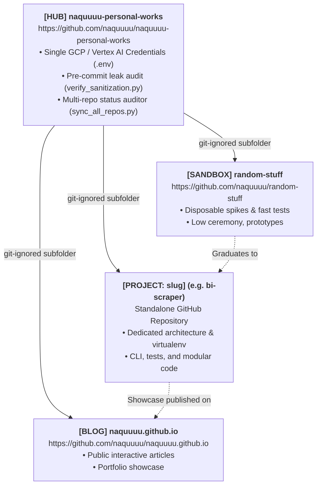

# NAQUUUU Workspace — Multi-Repo Dynamics & Prompt Guide

This guide documents the multi-repo orchestration across all personal repositories and provides prompt templates for kicking off serious projects.

---

## 1. Multi-Repo Dynamics & Architecture

All repositories operate independently without the fragility of git submodules:



| Repository | GitHub URL | Role in the Workflow |
| :--- | :--- | :--- |
| **Meta Hub** | [naquuuu/naquuuu-personal-works](https://github.com/naquuuu/naquuuu-personal-works) | Manages global configs, API keys, QA scripts, and coordinates all sub-projects. |
| **Sandbox** | [naquuuu/random-stuff](https://github.com/naquuuu/random-stuff) | Scratchpad for quick 10-minute curl/scraping tests before writing full code. |
| **Dedicated Project** | `naquuuu/<slug>` *(e.g. `bi-scraper`)* | Standalone, production-ready tool with its own Git lifecycle and virtual environment. |
| **Blog & Portfolio** | [naquuuu/naquuuu.github.io](https://github.com/naquuuu/naquuuu.github.io) | Where final visual reports, charts, or articles derived from scraped data get published. |

---

## 2. Anatomy of a High-Impact Project Prompt

To get production-grade output from an AI model rather than a toy script, specify five key dimensions:

1. **Routing Tag (`[PROJECT: <slug>]`)**: Triggers the AI to scaffold an isolated repository under `projects/<slug>/` instead of writing into the hub or sandbox.
2. **Target Data Scope**: Specifically state what data you want (e.g. BI-Rate / monetary policy decisions, exchange rates (JISDOR), foreign reserve updates, inflation statistics).
3. **Architecture & Tech Stack**: Specify library preferences (e.g., `requests` / `httpx` / `Playwright` for dynamic JavaScript pages, `polars` / `pandas` for dataframes, `sqlite` / `parquet` for local storage).
4. **Resilience & Politeness**: Scrapers must handle rate-limiting, user-agent headers, retries with exponential backoff, and logging.
5. **Clear Deliverables**: Specify a clean CLI interface (`argparse` or `typer`), unit tests (`pytest`), and a sanitized `.env` pattern inheriting from the hub.

---

## 3. Copy-Paste Template for Serious Projects (Bank Indonesia Scraper Example)

```
[PROJECT: bi-scraper]
I want to build a production-grade Bank Indonesia (BI) economic data scraper and research pipeline.

### 1. Workspace & Architecture Routing
- Scaffold this under `projects/bi-scraper/` as an independent repository with its own virtualenv (`.venv`) and `.git`.
- Inherit personal GCP/Gemini configuration from the hub root `.env` (do not hardcode credentials).
- The repo should be ready to link to a standalone remote: `https://github.com/naquuuu/bi-scraper`.

### 2. Target Data & Scope
Please focus on key macroeconomic indicators from the Bank Indonesia official portal (bi.go.id):
1. **BI-Rate (formerly BI 7-Day Reverse Repo Rate)**: Historical monetary policy rates and announcement dates.
2. **Exchange Rates (JISDOR - Jakarta Interbank Spot Dollar Rate)**: Daily USD/IDR reference rates and key currency pairs.
3. **Macroeconomic Indicators**: Inflation rates, national foreign exchange reserves (Cadangan Devisa), and money supply (M2).

### 3. Engineering Requirements & Tech Stack
- **Language & Runtime**: Python 3.10+ with type annotations throughout.
- **Scraping Engine**: Modern, resilient HTTP client (`httpx` or `requests`) with randomized browser User-Agents, exponential backoff retries, and rate limiting (polite crawling). If dynamic JavaScript hydration is required, use headless `playwright`.
- **Data Storage**: Export cleaned tabular data to local Parquet files (`data/processed/*.parquet`) and optionally SQLite (`data/bi_data.db`).
- **CLI Interface**: A clean CLI using `argparse` or `typer` with commands like:
  - `python -m bi_scraper fetch --indicator bi-rate --start-date 2024-01-01`
  - `python -m bi_scraper fetch --indicator jisdor --days 30`
  - `python -m bi_scraper export --format csv`

### 4. Definition of Done & Quality Standards
- Adhere to the workspace Definition of Done in `AGENTS.md`.
- Include `pytest` unit tests with mocked HTML fixtures to prevent hitting live servers during CI.
- Generate a comprehensive `README.md` explaining installation, CLI commands, and data schema.
- Run `python scripts/verify_sanitization.py` from the hub root to ensure zero credential leaks.
```
