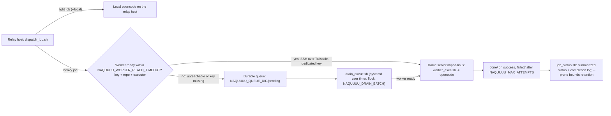

# M2 Dispatch Runbook (Worker + Durable Queue)

- Purpose: run heavy engineering jobs on the home server (`mipad-linux`) instead of the 2 vCPU / 2 GB relay host, and not lose jobs in the tested paths when the worker is offline.
- Status: **Approved and partially staged (2026-09-28)** (ADR-029). Drain timer active; an isolated offline-queue test passed. Worker SSH trust is still blocked by login authentication, so no real worker execution has passed and the relay skill remains local for heavy work.
- Related: `internal-docs/DECISION_LOG.md` ADR-026, ADR-027, ADR-028, ADR-029 (root-owned context only; this runbook does not depend on it for the interface facts below); `internal-docs/HOSTS.md` Sections 1-3 and 9; `internal-docs/relay/VPS_RELAY_RUNBOOK.md`; `internal-docs/relay/RELAY_PLAN.md`; `internal-docs/TAILSCALE_ACL.md`.
- Scope: M2 = the relay host dispatches heavy jobs to the worker over Tailscale and queues them durably when the worker is unreachable. Light work stays on the relay host.
- Non-goals: the worker is expected not to commit or push. That is a policy expectation, not an enforced mechanism: the worker clone is a replica without push credentials (a push cannot succeed), but a commit is not a security boundary. Auto-sync owns convergence (ADR-025/ADR-026). DO Managed Agents stays behind the Phase 4 gate set (`HOSTS.md` Section 9).

## 1. Architecture

Relay host = the VPS (`~/naquuuu` clone). Worker = the home server `mipad-linux` (`~/naquuuu` clone). Transport = SSH over Tailscale with a dedicated relay-to-worker key.

Job lifecycle: `pending/` -> `done/` on success; `pending/` -> `failed/` after `NAQUUUU_MAX_ATTEMPTS`. Job files are header-prefixed plain text (no `jq` dependency). Job bodies are stored verbatim under `NAQUUUU_QUEUE_DIR` and must be Tier 2 workspace text only (owner responsibility). A missing or unusable worker SSH key is treated as "worker not ready", so the job queues instead of failing. On success the drain archives the output under `done/` and appends a completion line to `$QDIR/completed.log`.

## 2. Components

| Script | Runs on | Role |
| :--- | :--- | :--- |
| `scripts/dispatch_job.sh` | Relay host | Sends a heavy task to the worker over SSH when the worker is ready; enqueues durably and prints `QUEUED <id>` when not. Flags: `--local`, `--agent NAME`, `--dry-run`, `--`; the task is positional or on stdin. `--local` keeps light work on the relay host (RELAY_PLAN Section 1). |
| `scripts/drain_queue.sh` | Relay host | Drains at most `NAQUUUU_DRAIN_BATCH` job(s) per tick under `flock`; wraps the remote run in `timeout` (`NAQUUUU_JOB_TIMEOUT`); archives success output under `done/` and appends a completion line to `$QDIR/completed.log`; `--dry-run` lists what would run and touches neither the network nor opencode. |
| `scripts/install_dispatch_drain.sh` | Relay host | Installs `~/.local/bin/naquuuu-drain` plus the `naquuuu-drain.service` / `naquuuu-drain.timer` systemd user units. Writes `~/.config/naquuuu/dispatch.env` as the unit `EnvironmentFile` and sets unit timeouts, so the tunables reach the timer. Idempotent. |
| `scripts/job_status.sh` | Relay host | Prints summarized queue state (`pending/`, `done/`, `failed/`, recent completions); `--prune` bounds retention to `NAQUUUU_QUEUE_KEEP`. Installed as `~/.local/bin/naquuuu-job-status`. |
| `scripts/worker_exec.sh` | Worker | Best-effort pull, then `opencode run` on the task; expected not to commit or push (policy; the replica has no push credentials). |
| `scripts/authorize_worker.sh` | Worker (owner-run) | Authorizes the relay-to-worker public key in `~/.ssh/authorized_keys` idempotently; no shared private keys. |

## 3. Prerequisites

- Relay host: Linux with systemd user services and linger enabled (already set for the Hermes gateway, ADR-026); Tailscale up.
- Relay host: the dedicated relay-to-worker key pair at `~/.ssh/id_ed25519_worker` (`NAQUUUU_WORKER_KEY`), generated on the relay host.
- Worker (`mipad-linux`): onboarded and synced (ADR-025), Tailscale up; the owner follow-ups listed in `STATUS.md` (`opencode auth login`, reboot) resolved before activation.
- Owner approval for M2 activation.
- Tailnet ACL hardening (`internal-docs/TAILSCALE_ACL.md`) should land with or before M2 so only personal devices can reach the worker.

## 4. Install - relay host

1. Place the M2 scripts in the relay host clone at `~/naquuuu/scripts/`.
2. Confirm the env tunables (Section 5). The installer writes `~/.config/naquuuu/dispatch.env` so the systemd timer sees them; values exported only in an interactive shell do not reach the unit. Never place secrets, phone numbers, IDs, or JIDs in the queue.
3. Install the drain timer and status helper: `bash scripts/install_dispatch_drain.sh`.
4. Confirm the timer is active: `systemctl --user list-timers naquuuu-drain.timer` and `systemctl --user status naquuuu-drain.service` (exact unit names; Section 10).
5. Confirm the status helper: `~/.local/bin/naquuuu-job-status` and `~/.local/bin/naquuuu-job-status --prune`.
6. Leave the relay skill on local execution until the worker trust is authorized (Section 6) and the owner approves.

## 5. Env tunables

| Variable | Default | Meaning |
| :--- | :--- | :--- |
| `NAQUUUU_WORKER_HOST` | `mipad-linux` | Tailscale hostname of the worker. |
| `NAQUUUU_WORKER_USER` | `ubuntu` | SSH user on the worker. |
| `NAQUUUU_WORKER_KEY` | `$HOME/.ssh/id_ed25519_worker` | Dedicated relay-to-worker private key. Pinned as `-i $NAQUUUU_WORKER_KEY -o IdentitiesOnly=yes`; a missing key is "worker not ready", so jobs queue. |
| `NAQUUUU_WORKER_REPO` | `$HOME/naquuuu` | Worker clone path. |
| `NAQUUUU_REPO` | `$HOME/naquuuu` | Relay clone path (alias/fallback). |
| `NAQUUUU_QUEUE_DIR` | `$HOME/.naquuuu/queue` | Queue root; holds `pending/`, `done/`, `failed/`, and `completed.log`. |
| `NAQUUUU_WORKER_REACH_TIMEOUT` | `5` | Seconds to wait for the worker before queueing. |
| `NAQUUUU_JOB_TIMEOUT` | `1800` | Seconds before a remote job run is wrapped in `timeout`. |
| `NAQUUUU_QUEUE_KEEP` | `50` | Retained `done/` and `failed/` entries kept by `job_status.sh --prune`. |
| `NAQUUUU_MAX_ATTEMPTS` | `3` | Attempts before a job moves to `failed/`. |
| `NAQUUUU_DRAIN_BATCH` | `1` | Jobs drained per timer tick (under `flock`). |
| `OPENCODE_ATTACH` | `http://127.0.0.1:4096` | Warm opencode server on the executing host. |
| `NAQUUUU_OPENCODE` | `opencode` | opencode binary name or path. |

## 6. Worker trust (owner-run)

1. On the relay host, generate the dedicated key if it does not exist: `ssh-keygen -t ed25519 -f ~/.ssh/id_ed25519_worker -N ""`. The private key stays on the relay host; this is the key the scripts pin.
2. One-command trust: on the worker, run
   `bash ~/naquuuu/scripts/authorize_worker.sh "<relay-worker public key>"`
   where `<relay-worker public key>` is the exact contents of `~/.ssh/id_ed25519_worker.pub` on the relay host. The owner obtains the exact value with
   `ssh ubuntu@vm-0-8-ubuntu cat ~/.ssh/id_ed25519_worker.pub`
   Do not fabricate or commit a key value; the public key is supplied at run time.
3. From the relay host, confirm reachability over Tailscale: `tailscale ping mipad-linux`, then a key-only SSH login: `ssh -i ~/.ssh/id_ed25519_worker -o IdentitiesOnly=yes ubuntu@mipad-linux true`.
4. Only after reachability succeeds and the owner approves: switch the relay skill to dispatch.

## 7. Verification

Run after install; treat any mismatch as an open question, not a fix-up guess.

1. Script interface: `bash scripts/dispatch_job.sh --help` (confirms the flags: `--local`, `--agent NAME`, `--dry-run`, `--`).
2. Queue at rest: `~/.local/bin/naquuuu-job-status` shows nothing pending; `ls -1 "$HOME/.naquuuu/queue/pending"` is empty.
3. Timer scheduled: `systemctl --user list-timers naquuuu-drain.timer` lists the timer.
4. Worker reachable: `tailscale ping mipad-linux` succeeds; the key-only SSH login in Section 6 step 3 succeeds.
5. End-to-end direct path (only after trust + approval): dispatch one light sanity task while the worker is reachable; the task runs synchronously and its output returns; the job is not queued.
6. Offline path: power the worker off, dispatch a job, confirm it lands in `pending/`; bring the worker back and confirm the drain moves it to `done/` and appends to `$QDIR/completed.log`.
7. Queued output is not auto-replied: `done/` holds the archived output and `job_status.sh` summarizes it. The relay skill is not yet wired to poll the queue (pending approval), so a queued job produces no automatic WhatsApp reply.

## 8. Rollback

1. Stop and disable the drain timer: `systemctl --user disable --now naquuuu-drain.timer`.
2. Revert the relay skill to local execution (heavy and light jobs run on the relay host, as in M1).
3. Leave queued jobs in `pending/` for review; move abandoned jobs to `failed/` explicitly. Never delete queued work silently.
4. Revoke the relay-to-worker key on the worker (remove the `~/.ssh/id_ed25519_worker` entry from `~/.ssh/authorized_keys`).
5. Update only the status notes after the rollback is verified; do not claim M2 was ever live.

## 9. Security notes

- Tier 2 task text only in the queue; never secrets, phone numbers, IDs, or JIDs (ADR-027, ADR-028). Job bodies are stored verbatim under `NAQUUUU_QUEUE_DIR` with no redaction, so keeping them Tier 2 is the owner's responsibility. `job_status.sh --prune` and `NAQUUUU_QUEUE_KEEP` bound how many completed and failed bodies are retained.
- The worker is expected to commit or push nothing; that is policy, not an enforced mechanism. The worker clone is a replica without push credentials, so a push cannot succeed, and a commit is not a security boundary. Sanitization, commit, and push gates stay on the relay host/laptop.
- Key-only SSH over Tailscale with the dedicated relay-to-worker key (`NAQUUUU_WORKER_KEY`, pinned with `-o IdentitiesOnly=yes`); no shared private keys.
- Accepted risk (M9): the SSH client uses `StrictHostKeyChecking=accept-new` on the Tailscale-private path (trust-on-first-use, host keys not pinned). The dedicated key limits identity confusion and the path stays inside the tailnet; treat this as an accepted risk, not a hardened control.
- One writer per tree stays in force (ADR-025): the worker pull is best-effort and auto-sync owns convergence.

## 10. Interface reference (resolved)

These were previously open questions; the shipped scripts now answer them. The interface below is the authority for this runbook. `internal-docs/DECISION_LOG.md` is root-owned and is not required reading for these facts.

1. `dispatch_job.sh` CLI: flags `--local`, `--agent NAME`, `--dry-run`, `--help`, `--`; the task is positional or supplied on stdin. It exits `2` when no task is given, prints `QUEUED <id>` and exits `0` when a job is enqueued, and otherwise passes through the local or remote exit code.
2. systemd units: `naquuuu-drain.service` and `naquuuu-drain.timer`, installed under `~/.config/systemd/user`. The runnable drain copy is `~/.local/bin/naquuuu-drain`; the status helper is `~/.local/bin/naquuuu-job-status`.
3. Queue file naming and header format: files are named `<epoch>-<rand>.job` with header lines `id:`, `created:`, `agent:`, `attempts:`, then a blank line followed by the verbatim body. `NAQUUUU_MAX_ATTEMPTS` increments the `attempts:` header and promotes `pending/` -> `failed/` once it is reached.
4. `worker_exec.sh` pull behavior: it runs `git pull --ff-only` before every job and, on failure, logs a diagnostic and continues on the current tree (it does not fail the job).
5. Key path and authorization: the relay-to-worker key is `~/.ssh/id_ed25519_worker` (`NAQUUUU_WORKER_KEY`). `authorize_worker.sh` appends the public key to `~/.ssh/authorized_keys` idempotently (creates `~/.ssh` mode 700 and `authorized_keys` mode 600) and leaves an already-present key unchanged.
