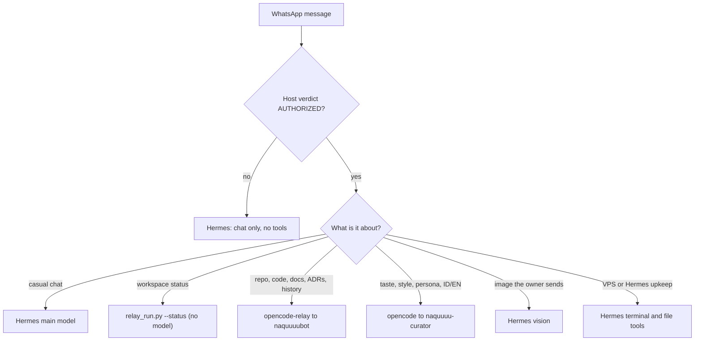

# Routing SOP: Hermes vs OpenCode

Decision: ADR-044. Rule of thumb: **Hermes handles conversation and the VPS itself. OpenCode handles anything that touches the workspace repo.** The repo is the record; Hermes memory is never the source of truth.

## Routing table

| # | Request | Goes to | Never |
|---|---|---|---|
| 1 | Greetings, casual chat, guests | Hermes main model | No tools for guests |
| 2 | Workspace status | Hermes runs `relay_run.py --status` | Never answer from Hermes memory |
| 3 | Repo work: code, scripts, blog, ADRs, history | `opencode-relay` to `naquuuubot` | Hermes never edits the repo itself |
| 4 | Taste, style, persona, Indonesian/English writing | `opencode run --agent naquuuu-curator` | Not the Hermes "Curator" (skill-usage review) |
| 5 | Gateway health, groups, Hermes upkeep | Hermes terminal/file tools, owner-run scripts | OpenCode never touches `~/.hermes` |
| 6 | Image the owner sends | Hermes vision; pass with `--file` if a repo task needs it | Retry vision at most once per turn |
| 7 | Planning, decomposition, code review | OpenCode (`naquuuubot`, skeptic, verifier) | Hermes Kanban, Triage and `/review` stay unused for workspace work |
| 8 | Commits, pushes, allowlisting, free-response groups | Owner, by hand | Never from chat |
| 9 | Heavy or long jobs | OpenCode, one task per run (M2 dispatch later) | Never chain tasks or replay a timed-out run |

Rules for both: one request, one system, one reply. Each system's models are set in one place (OpenCode: `opencode.jsonc`, checked by `scripts/verify_model_routing.py`; Hermes: the dashboard Models page). Neither is changed from chat.

## Tool ownership (WhatsApp platform)

| Tool | Status in Hermes | Why |
|---|---|---|
| `terminal`, `file`, `code_execution` | Enabled | `terminal` runs `relay_run.py`; file and code tools are for VPS upkeep only |
| `vision`, `image_gen`, `web`, `skills`, `memory`, `todo`, `session_search`, `clarify` | Enabled | Conversation and front-desk needs |
| `delegation` | Disabled | OpenCode `task` and its subagents do this |
| `browser` (incl. browser-use), `computer_use` | Disabled | Too heavy for the 2 GB VPS; visual audits run in OpenCode on the laptop |
| `connections`, `tts`, `cronjob` | Disabled | Unused; re-enable with `hermes tools enable --platform whatsapp <name>` when needed |
| `kanban` | Disabled | See rule 7 |

Hermes skills: only `opencode-relay` is active (pinned). Archived 2026-10-09 after 30 days unused, restorable with `hermes curator restore <name>`: `warm-personal-messages`, `whatsapp-group-voice`, `website-visual-audit`, `whatsapp-relay-admin`, `hermes-runtime-maintenance`.

Dashboard sidebar: unused pages (Files, Achievements, Cron, Plugins, MCP, Channels, Webhooks, Pairing, Profiles, Docs, Kanban) are hidden by `customCSS` in `dashboard-themes/*.yaml`; their URLs still work. Remove the `/* nav: */` block to show them again.

## Monthly usage check

Run, read only aggregates, and record totals in the decision log when they change materially:

- OpenCode, laptop hub: `opencode stats --days 30 --project "" --models`
- OpenCode and Hermes on the VPS: `opencode stats --days 30 --models`, `hermes insights --days 30`, `hermes prompt-size --platform whatsapp`
- Health: `python scripts/relay_vps_status.py`
