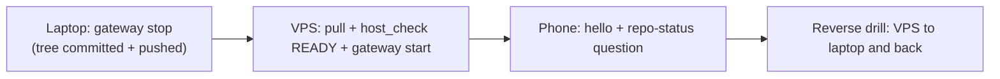

# VPS Relay Runbook (M1)

- Purpose: provision the always-on VPS relay so the WhatsApp front door survives the laptop being off.
- Status: M1 build ready; host purchase in progress — 2026-09-24.
- Related: `internal-docs/HOSTS.md` §4.3, §5.2, §5.4; `internal-docs/DECISION_LOG.md` ADR-019 amendment; `internal-docs/relay/README.md`.
- Scope: M1 = the relay survives the laptop being off (WhatsApp front door always on).
- Non-goals for M1: no repo writes or pushes from the VPS (one writer per tree, commits stay gated); heavy dev-task execution on the VPS is M2; DO Managed Agents stays behind the Phase 4 gate set (`HOSTS.md` §9).

## Target host

| Item | Value |
| :--- | :--- |
| Host | Tencent Cloud Lighthouse |
| Package | 2 vCPU / 2 GB RAM / 20 Mbps / 40 GB disk |
| Region | Singapore |
| Image | Ubuntu 24.04 LTS |
| Note | 2 GB is the M1 minimum (add swap); upgrade the package if M2 needs more |

## Step 0 — Purchase checklist

- [ ] Lighthouse "2vCPUs Linux" first-deal promo (2vCPUs2G 20M40G Starter).
- [ ] Region: Singapore.
- [ ] Image: **Ubuntu 24.04 LTS** (do NOT pick the app images: Hermes Agent, OpenCode, OpenClaw/Moltbot — their base layout is undocumented and versions are pinned old).
- [ ] 6-month term.
- [ ] Add an ed25519 SSH key at creation (no password login).
- [ ] Console firewall: allow TCP 22 only (restrict to owner IPs where possible); everything else via Tailscale.

## Step 1 — Base setup (default sudo user, e.g. `ubuntu`)

```bash
sudo apt update && sudo apt upgrade -y
sudo apt install -y curl xz-utils git ufw unattended-upgrades
```

- Swap: create a 2 GB swap file — `sudo fallocate -l 2G /swapfile`, `sudo chmod 600 /swapfile`, `sudo mkswap /swapfile`, `sudo swapon /swapfile` — and persist it in `/etc/fstab`.
- Timezone: `sudo timedatectl set-timezone Asia/Jakarta`.
- UFW: `sudo ufw default deny incoming`; `sudo ufw default allow outgoing`; `sudo ufw allow OpenSSH`; `sudo ufw allow in on tailscale0`; `sudo ufw enable`.
- Enable unattended-upgrades.

## Step 2 — Tailscale

```bash
curl -fsSL https://tailscale.com/install.sh | sh
sudo tailscale up
```

- Owner authenticates.
- Note the tailnet node name.
- Optional later: `sudo tailscale set --ssh` (phone SSH without keys).

## Step 3 — Hermes (per-user, lean)

```bash
curl -fsSL https://hermes-agent.nousresearch.com/install.sh | bash -s -- --skip-browser --skip-computer-use
sudo loginctl enable-linger <user>
```

- `enable-linger` keeps the user service alive across logout and reboot.
- Provider keys: configure owner-side (`hermes model` / `~/.hermes/.env`); personal model routing stays on the personal GCP project per AGENTS.md Critical Rule 3; never in chat or the repo.
- WhatsApp values in `~/.hermes/.env`: mirror the laptop's WhatsApp-related lines only (WHATSAPP_ENABLED / WHATSAPP_MODE / WHATSAPP_ALLOWED_USERS / WHATSAPP_GROUP_POLICY / WHATSAPP_GROUP_ALLOWED_USERS / WHATSAPP_REQUIRE_MENTION).
- The hub `.env` (`C:\personal\naquuuu\.env`) never goes to the VPS.
- Do not start the gateway yet.

## Step 4 — opencode + runtime clone

```bash
curl -fsSL https://opencode.ai/install | bash
git clone https://github.com/naquuuu/naquuuu-personal-works.git ~/naquuuu
```

- The repo is public: read-only clone, no credentials on the box.
- Owner-side provider auth for opencode.
- Smoke test (no writes, no commits): `cd ~/naquuuu && opencode run --agent naquuuubot "Reply with the current branch."`

## Step 5 — Relay skill (Linux variant)

- Install to `~/.hermes/skills/relay/opencode-relay/SKILL.md` using the exact block in the Appendix.
- The Windows canonical copy stays in `internal-docs/relay/README.md`.

## Step 6 — WhatsApp session move

Only ONE bridge may run at a time — never laptop and VPS together.

1. Laptop: `hermes gateway stop`.
2. Keep a copy of `%LOCALAPPDATA%\hermes\whatsapp\session` as the rollback backup.
3. On the VPS, verify the bridge's expected session path (`~/.hermes/whatsapp/session`; if the installed version uses `platforms/whatsapp/...`, place it there — check the bridge process args).
4. Transfer over Tailscale (scp/WinSCP), owner-run; never through chat or the repo.
5. `hermes gateway install` and `hermes gateway start`.
6. Verify with `hermes gateway status` plus a phone "hello".
7. Fallback if the copied session is rejected: `hermes whatsapp` QR re-pair (owner-private scan).

## Step 7 — Readiness + switch drill

1. `cd ~/naquuuu && python scripts/host_check.py` → expect READY.
2. Run the `HOSTS.md` §5.4 drill both directions; log results.



## Step 8 — Rollback

1. Stop the VPS gateway.
2. Restore the laptop session copy if needed.
3. Start the laptop gateway.
4. Verify with a phone "hello".

## Security notes

- No hub `.env` on the VPS.
- Tier 1 never in model context.
- SSH key-only; UFW enabled.
- Unattended upgrades on.
- Tailscale-only admin access.
- Kill switch from the phone: tailnet SSH → `hermes gateway stop`.

## Deferred

- M2: VPS dev execution + commit/push policy; possible 4 GB upgrade.
- Relay multi-turn parity.
- DO Stage A behind the Phase 4 gates.

## Appendix — Relay skill (Linux) canonical copy

```markdown
---
name: opencode-relay
description: "Route NAQUUUU workspace questions and engineering tasks from WhatsApp to the local opencode orchestrator (naquuuubot) and return the result."
version: 2.0.0
author: naquuuu
license: MIT
platforms: [linux]
metadata:
  hermes:
    tags: [relay, opencode, workspace, engineering, orchestration, status]
prerequisites:
  commands: [opencode]
---

# OpenCode Relay (Linux / VPS)

Use this skill for anything about the NAQUUUU workspace: status questions, plan or history questions, and engineering work.

## 1. Questions about status, plans, or history

Answer from the repository, never from memory:

1. Read `~/naquuuu/internal-docs/STATUS.md` first (current state digest).
2. For details, search `~/naquuuu/internal-docs/` and `git log` in `~/naquuuu`.
3. Answer with the source path(s). If the workspace does not answer it, say "not in the workspace" explicitly.

## 2. Engineering tasks (development)

1. Work from the clone: `cd ~/naquuuu`
2. Run the task headlessly, one task per call:
   `opencode run "Read internal-docs/STATUS.md for context. Task: <task>. Report changed files, commands run, and evidence. Do not commit or push."`
   Optionally pin the agent: `opencode run --agent naquuuubot "<task>"`
3. Return the agent's final output to the owner, trimmed to the essentials. For jobs longer than a minute, prefix the reply with `job <HHMM>`.

## Prompt shape

Give opencode: the goal, file paths (never pasted content), and done-when criteria.

## Rules

- Never include secrets, phone numbers, keys, or tokens in the prompt.
- `git commit` and `git push` are gated: report changed files and tell the owner a commit needs approval.
- One task per run; no chained mega-prompts.
- M1: no pushes from this host; heavy dev work may wait for the laptop or M2.
- If `opencode run` fails, return the error lines only.
```
