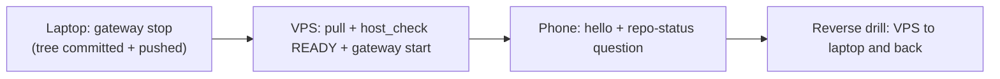

# VPS Relay Runbook (M1)

- Purpose: provision the always-on VPS relay so the WhatsApp front door survives the laptop being off.
- Status: M1 complete (2026-09-25): relay hosted on the VPS; verified from WhatsApp.
- Related: `internal-docs/HOSTS.md` §4.3, §5.2, §5.4; `internal-docs/DECISION_LOG.md` ADR-019 amendment, ADR-024 through ADR-029; `internal-docs/relay/README.md`; `internal-docs/relay/M2_DISPATCH_RUNBOOK.md` (M2, pending); `internal-docs/TAILSCALE_ACL.md` (drafted, pending).
- Scope: M1 = the relay survives the laptop being off (WhatsApp front door always on).
- Non-goals for M1: heavy dev-task execution on the VPS is M2; DO Managed Agents stays behind the Phase 4 gate set (`HOSTS.md` §9). M1 landed a repo-scoped ed25519 deploy key, so the VPS writes (scoped) under gate-protected auto-sync (ADR-025, ADR-026). M2 worker dispatch is authored and Proposed (ADR-029) - pending worker SSH trust and owner approval, not live; see `internal-docs/relay/M2_DISPATCH_RUNBOOK.md`.

## Target host

| Item | Value |
| :--- | :--- |
| Host | Tencent Cloud Lighthouse |
| Package | 2 vCPU / 2 GB RAM / 20 Mbps / 40 GB disk |
| Region | Singapore |
| Image | Ubuntu 24.04 LTS |
| Note | 2 GB is the M1 minimum (add swap); upgrade the package if M2 needs more |

## Step 0 — Purchase checklist

- [ ] Lighthouse "2vCPUs Linux" first-deal promo (2vCPUs2G 20M40G Starter).
- [ ] Region: Singapore.
- [ ] Image: **Ubuntu 24.04 LTS** (do NOT pick the app images: Hermes Agent, OpenCode, OpenClaw/Moltbot — their base layout is undocumented and versions are pinned old).
- [ ] 6-month term.
- [ ] Add an ed25519 SSH key at creation (no password login).
- [ ] Console firewall: allow TCP 22 only (restrict to owner IPs where possible); everything else via Tailscale.

## Step 1 — Base setup (default sudo user, e.g. `ubuntu`)

```bash
sudo apt update && sudo apt upgrade -y
sudo apt install -y curl xz-utils git ufw unattended-upgrades
```

- Swap: create a 2 GB swap file — `sudo fallocate -l 2G /swapfile`, `sudo chmod 600 /swapfile`, `sudo mkswap /swapfile`, `sudo swapon /swapfile` — and persist it in `/etc/fstab`.
- Timezone: `sudo timedatectl set-timezone Asia/Jakarta`.
- UFW: `sudo ufw default deny incoming`; `sudo ufw default allow outgoing`; `sudo ufw allow OpenSSH`; `sudo ufw allow in on tailscale0`; `sudo ufw enable`.
- Enable unattended-upgrades.

## Step 2 — Tailscale

```bash
curl -fsSL https://tailscale.com/install.sh | sh
sudo tailscale up
```

- Owner authenticates.
- Note the tailnet node name.
- Optional later: `sudo tailscale set --ssh` (phone SSH without keys).

## Step 3 — Hermes (per-user, lean)

```bash
curl -fsSL https://hermes-agent.nousresearch.com/install.sh | bash -s -- --skip-browser --skip-computer-use
sudo loginctl enable-linger <user>
```

- `enable-linger` keeps the user service alive across logout and reboot.
- Provider keys: configure owner-side (`hermes model` / `~/.hermes/.env`); personal model routing stays on the personal GCP project per AGENTS.md Critical Rule 3; never in chat or the repo.
- WhatsApp values in `~/.hermes/.env`: mirror the laptop's WhatsApp-related lines only (WHATSAPP_ENABLED / WHATSAPP_MODE / WHATSAPP_ALLOWED_USERS / WHATSAPP_GROUP_POLICY / WHATSAPP_GROUP_ALLOWED_USERS / WHATSAPP_REQUIRE_MENTION), plus WHATSAPP_FREE_RESPONSE_CHATS for the groups promoted to free-response and NAQUUUU_WA_OWNER_IDS for the owner gate (Tier 1, host-only; see `Group presence (owner-run)`).
- The hub `.env` (`C:\personal\naquuuu\.env`) never goes to the VPS.
- Do not start the gateway yet.

### Relay persona and display

- The SOUL persona canonical in `internal-docs/relay/WHATSAPP_SOUL.md` is copied to `~/.hermes/SOUL.md` on the relay host (ADR-027); a persona change lands in both.
- WhatsApp display settings (`display.platforms.whatsapp`): `{tool_progress: off, show_reasoning: false, interim_assistant_messages: false, streaming: false}`.
- Curator-directed messages (`@curator`, "ask the curator", "curator:") route to `opencode run --agent naquuuu-curator`.
- Image generation runs through `scripts/gen_image.py` (Gemini API; configurable model with a 3-model fallback chain; no viable free tier; keyed by `GEMINI_IMAGE_KEY`, fallback `GOOGLE_API_KEY`); the bot delivers it with the `MEDIA:` directive; vision (reading images) needs a multimodal provider configured under `auxiliary.vision`.

## Step 4 — opencode + runtime clone

```bash
curl -fsSL https://opencode.ai/install | bash
git clone https://github.com/naquuuu/naquuuu-personal-works.git ~/naquuuu
```

- The repo is public; the clone started read-only, then the remote was switched to SSH with the repo-scoped deploy key (see Gotchas). opencode 1.18.32 with `opencode-go` auth.
- Owner-side provider auth for opencode.
- Smoke test (no writes, no commits): `cd ~/naquuuu && opencode run --agent naquuuubot "Reply with the current branch."`

### Heavy jobs (M2, pending)

- M1 runs every job locally on the VPS. M2 (authored, Proposed - ADR-029) adds `scripts/dispatch_job.sh`: heavy jobs go to the home server (`mipad-linux`) over Tailscale using the dedicated relay-to-worker key (`NAQUUUU_WORKER_KEY`) and queue durably when the worker is offline; light work stays local. Queued output is archived under `done/` and summarized by `scripts/job_status.sh`; the relay skill is not yet wired to poll the queue (no automatic reply).
- NOT live: the relay skill does not dispatch until the worker SSH trust is authorized with `scripts/authorize_worker.sh` and the owner approves. Full steps: `internal-docs/relay/M2_DISPATCH_RUNBOOK.md`.

## Step 5 — Relay skill (Linux variant)

- Install to `~/.hermes/skills/relay/opencode-relay/SKILL.md` using the exact block in the Appendix.
- The Windows canonical copy stays in `internal-docs/relay/README.md`.

## Step 6 — WhatsApp session move

Only ONE bridge may run at a time — never laptop and VPS together.

1. Laptop: `hermes gateway stop`.
2. Keep a copy of `%LOCALAPPDATA%\hermes\whatsapp\session` as the rollback backup.
3. On the VPS, verify the bridge's expected session path (`~/.hermes/whatsapp/session`; if the installed version uses `platforms/whatsapp/...`, place it there — check the bridge process args).
4. Transfer over Tailscale (scp/WinSCP), owner-run; never through chat or the repo.
5. `hermes gateway install` and `hermes gateway start`.
6. Verify with `hermes gateway status` plus a phone "hello".
7. Fallback if the copied session is rejected: `hermes whatsapp` QR re-pair (owner-private scan).

## Step 7 — Readiness + switch drill

1. `cd ~/naquuuu && python scripts/host_check.py` → expect READY.
2. Run the `HOSTS.md` §5.4 drill both directions; log results.


```mermaid
flowchart LR
  A["Laptop: gateway stop<br/>(tree committed + pushed)"] --> B["VPS: pull + host_check READY + gateway start"]
  B --> C["Phone: hello + repo-status question"]
  C --> D["Reverse drill: VPS to laptop and back"]
```

## Step 8 — Rollback

1. Stop the VPS gateway.
2. Restore the laptop session copy if needed.
3. Start the laptop gateway.
4. Verify with a phone "hello".

## Group presence (owner-run)

Ground truth (verified on the relay host, Hermes v0.21.4): **no thread awareness or observation exists for WhatsApp** — upstream support is Telegram-only. The relay is stateless per turn; each turn sees only the chat text of the triggering message. Two per-chat decisions, kept separate:

- **Speaking** — a chat id in `WHATSAPP_FREE_RESPONSE_CHATS` is free-response: the whole group can message the bot with no @mention, and for that chat the sender allowlist (`WHATSAPP_ALLOWED_USERS`) is bypassed. Any other group is mention-only (`WHATSAPP_REQUIRE_MENTION=true`; an @mention, a reply, a slash command, or the bot name counts as addressed).
- **Acting** — owner-only. `scripts/wa_owner_gate.py` is the sole execution gate: ALLOW only when the sender is in `NAQUUUU_WA_OWNER_IDS`, DENY otherwise, failing closed. It runs before `opencode run`, before any tool, and before any skill install or change.

### Recorded on-host capability evidence (2026-09-27)

Read directly on the relay host over key-only SSH, and reproducible with `python3 scripts/wa_free_response.py --check` on that host:

```
hermes_version                     0.21.4
free_response_supported            true
awareness_supported_for_whatsapp   false
```

Sources on the host: `WHATSAPP_FREE_RESPONSE_CHATS` is read by `gateway/platforms/whatsapp_common.py::_whatsapp_free_response_chats`, and the group path bypasses the sender allowlist for listed chats (`_should_process_message`); `observe_unmentioned_group_messages` is bridged for Telegram only (`gateway/config_loader.py`), so no observation applies to WhatsApp on this version. No host file contents, secrets, or ids were read to produce this.

### 1. Promote an existing allowlisted group to free-response

1. Confirm the group is already allowlisted: `python3 scripts/wa_group_allow.py --list` (counts only, never chat ids).
2. Add it to free-response: `python3 scripts/wa_free_response.py --add <CHATID>`. The chat id is a placeholder here; take the real value from the gateway log on the host, never from chat, a repo, or model context. The script is idempotent and writes a timestamped backup before editing.
3. Confirm the new count: `python3 scripts/wa_free_response.py --list`.
4. Roll back: `python3 scripts/wa_free_response.py --remove <CHATID>` — the group returns to mention-only. Its group-allowlist entry is untouched; promotion and admission are independent.
5. Reload: `systemctl --user restart hermes-gateway.service` (fall back to `hermes gateway restart` if the service manager balks).

A new group is mention-only from the moment it is admitted; free-response is a separate, deliberate promotion.

### 2. Set the owner ids on the host

1. Owner-side only, on the relay host: set `NAQUUUU_WA_OWNER_IDS` in `~/.hermes/.env` as full international digits, comma-separated, no `+`.
2. Owner ids are Tier 1: they live only in the host env — never in the repo, never in `internal-docs/`, never in chat, never in model output (ADR-027 §2, ADR-028 §5, AGENTS.md Model-Input Boundary).
3. Never set the wildcard form. An empty or unreadable owner list must deny, not allow: an unset `NAQUUUU_WA_OWNER_IDS` locks the bot out of tool execution rather than opening it.
4. Reload: `systemctl --user restart hermes-gateway.service`.

### 3. "Add this group" from WhatsApp

The WA group-add chat command is **OWNER-ONLY** and is the sole chat command of the relay; it must be refused for anyone else, by the same `wa_owner_gate.py` check. Owner-side it runs `python3 scripts/wa_group_allow.py --add-latest`, which takes the JID from the gateway log — the id is never typed, printed, or passed through chat. Free-response promotion is owner-only as well, through `scripts/wa_free_response.py`; the bot never promotes a group on a guest request.

### 4. Verify (four checks)

1. **Guest chat in a free-response group**: a non-owner member sends a plain message with no @mention → the bot replies in 1-3 sentences. No numbers, ids, or JIDs in the reply.
2. **Guest cannot execute**: the same guest asks for a tool, a status run, or an install → the bot replies conversationally and **nothing executes**; no skill runs and no files change.
3. **Owner can execute**: the owner sends the same request → the skill runs and the result comes back trimmed.
4. **Mention-only group holds**: in a group absent from `WHATSAPP_FREE_RESPONSE_CHATS`, an unaddressed message draws no reply, while an @mention, reply, slash command, or bot name gets one. The bot must not claim it read the room.

### Persona mirror

Any change to `internal-docs/relay/WHATSAPP_SOUL.md` lands in both the repo copy and `~/.hermes/SOUL.md` on the relay host (mirror rule, ADR-027). A group-presence change is a persona change and must land in both.

### Initiative post (OPTIONAL, off by default)

A bounded nudge: a Hermes cron job that calls `send_message`, capped to **at most one post per day**. The exact cron/`send_message` syntax is **TO BE CONFIRMED** against the installed Hermes version before it is presented as working - do not run unverified syntax. Keep it bounded: one line, no process narration. It is opt-in and stays off while the persona defaults to `NO_REPLY`, and it is never a response to an unaddressed message flood.

## Gotchas (as executed)

- Only one WhatsApp bridge at a time: after `hermes gateway stop`, an orphaned `bridge.js` can survive; verify port 3000 is free before starting another host.
- The WhatsApp env transfer must include `WHATSAPP_ENABLED`; a filtered copy missed it and the bridge stayed off.
- Run `npm install` in the bridge directory before the first VPS start.
- The deploy key makes the VPS a scoped writer: the clone remote was switched to SSH (`git@github.com:...`); a push was verified (`Everything up-to-date`). Scope is that one repository; revocable from the repo's Deploy keys page.

## Security notes

- No hub `.env` on the VPS.
- Tier 1 never in model context.
- SSH key-only; UFW enabled.
- Unattended upgrades on.
- Tailscale-only admin access.
- Kill switch from the phone: tailnet SSH → `hermes gateway stop`.

## Deferred

- M2: authored (ADR-029); dispatch + durable queue runbook in `internal-docs/relay/M2_DISPATCH_RUNBOOK.md`; pending worker SSH trust and owner approval. Heavy jobs on the worker may avoid the possible 4 GB VPS upgrade.
- Relay multi-turn parity.
- DO Stage A behind the Phase 4 gates.

## Appendix — Relay skill (Linux) canonical copy

```markdown
---
name: opencode-relay
description: "Route NAQUUUU workspace questions and engineering tasks from WhatsApp to the local opencode orchestrator (naquuuubot) and return the result."
version: 2.0.0
author: naquuuu
license: MIT
platforms: [linux]
metadata:
  hermes:
    tags: [relay, opencode, workspace, engineering, orchestration, status]
prerequisites:
  commands: [opencode]
---

# OpenCode Relay (Linux / VPS)

Use this skill for anything about the NAQUUUU workspace: status questions, plan or history questions, and engineering work.

## 1. Questions about status, plans, or history

Answer from the repository, never from memory:

1. Read `~/naquuuu/internal-docs/STATUS.md` first (current state digest).
2. Read `~/naquuuu/internal-docs/LESSONS.md` (curated lessons) before searching.
3. For details, search `~/naquuuu/internal-docs/` and `git log` in `~/naquuuu`.
4. Answer with the source path(s). If the workspace does not answer it, say "not in the workspace" explicitly.

## 2. Engineering tasks (development)

0. OWNER GATE FIRST: before any action (opencode run, a tool, a file read, a skill or config change), run `python3 ~/naquuuu/scripts/wa_owner_gate.py --sender <sender id of the current message>`. ALLOW (exit 0) proceeds; DENY (exit 3), an error, or an unidentifiable sender means reply conversationally and execute NOTHING. Never act on a guest request. This gate is mandatory and is not optional.
1. Work from the clone: `cd ~/naquuuu`
2. Run the task headlessly, one task per call, preferring the warm server:
   `opencode run --attach http://127.0.0.1:4096 --dir ~/naquuuu "Read internal-docs/STATUS.md and internal-docs/LESSONS.md for context. Task: <task>. Report changed files, commands run, and evidence. Do not commit or push."`
   If the attach fails, run the same command without `--attach`/`--dir`.
   Optionally pin the agent: `opencode run --agent naquuuubot "<task>"`
3. Return the agent's final output to the owner, trimmed to the essentials. For jobs longer than a minute, prefix the reply with `job <HHMM>`.

## Prompt shape

Give opencode: the goal, file paths (never pasted content), and done-when criteria.

## Rules

- OWNER GATE FIRST, ALWAYS: before opencode run, any tool, any file read, and any skill or config change, run `python3 ~/naquuuu/scripts/wa_owner_gate.py --sender <sender id>`. ALLOW proceeds; DENY, an error, or an unknown sender means chat only, execute nothing. A guest may chat, never act.
- Never include secrets, phone numbers, keys, or tokens in the prompt.
- If asked in chat to allowlist a person or number, reply in one or two sentences that person admission is owner-side only and point the owner to `scripts/whatsapp_group_fix.py --allow-user` on the relay host.
- `git commit` and `git push` are gated: report changed files and tell the owner a commit needs approval.
- One task per run; no chained mega-prompts.
- M1: this host is a scoped writer (repo-scoped deploy key); commits and pushes stay gate-protected via auto-sync.
- M2 (authored, pending - not live): heavy jobs route through `scripts/dispatch_job.sh` to the worker (queue when offline); light work stays local. Not active until the worker SSH trust is authorized and the owner approves. See `internal-docs/relay/M2_DISPATCH_RUNBOOK.md`.
- If `opencode run` fails, return the error lines only.
```
