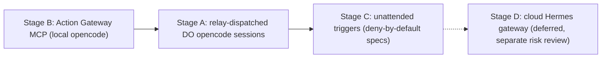

# DigitalOcean Managed Agents: Phase 4 Integration Research

- Date: 2026-09-23
- Status: Research draft retained for reference. Recorded as ADR-019 (Accepted) in internal-docs/DECISION_LOG.md on 2026-09-23.
- Fact base: DigitalOcean product docs, pricing pages, and legal pages, fetched 2026-09-23
- Scope: integration of DigitalOcean Managed Agents (public preview since 2026-09-21) into the NAQUUUU workspace as a Phase 4 remote execution host and MCP layer
- Citation convention: product claims link to the source URL from the fact base; workspace claims cite repository paths. Arithmetic derived from published rates is labeled "derived estimate". Unverified items are listed only under Open Questions.

## Verdict

Adopt a staged integration. Do not migrate critical paths.

1. First, Stage B: Action Gateway as a standalone MCP layer for the local opencode config. No compute migration; credentials brokered outside the sandbox. ([Action Gateway docs](https://docs.digitalocean.com/products/managed-agents/action-gateway/index.html.md); [quickstart](https://docs.digitalocean.com/products/managed-agents/action-gateway/quickstart/index.html.md))
2. Second, Stage A: Harness Runtime as a relay-dispatched remote opencode host. This directly addresses the ADR-018 dependency on the laptop being awake, at the cost of preview risk and RIC1-only placement. ([Harness Runtime docs](https://docs.digitalocean.com/products/managed-agents/agent-harness-runtime/index.html.md); internal-docs/DECISION_LOG.md ADR-018)
3. Third, Stage C: unattended cron and webhook triggers, only after deny-by-default specs (no ask rules) are proven. Triggered runs reject specs whose permissions default is ask or that contain any ask rule, and auto-approve any ask that still occurs, so deny rules are the only hard guard. ([Harness Runtime docs](https://docs.digitalocean.com/products/managed-agents/agent-harness-runtime/index.html.md))
4. Deferred, Stage D: cloud Hermes gateway, pending a separate risk review; the WhatsApp session and credentials raise the exposure. (internal-docs/relay/README.md; internal-docs/DECISION_LOG.md ADR-018)
5. All gates, sanitization, and commit/push stay local and are never re-hosted under preview terms: no SLA, no support obligations, no data durability guarantees. Remote sessions may read repos and run checks inside the sandbox, with no writes to the hub or child repos; gate scripts, commits, and pushes stay local. ([Preview terms](https://digitalocean.com/legal/mars-preview-terms))

Owner decisions required before Stage A: D1 (Rule 3 scope), D2 (model override policy), D3 (preview-only posture), D5 (secret policy), D6 (budget ceiling), D8 (GitHub team account), D9 (repo allowlist). D10 (doctl credential handling) is closed: env-var path used, no `%APPDATA%\doctl\config.yaml` exists, deny rule not needed. See Conflicts and Required Decisions.

Architecture statement (applies throughout this document): DO Managed Agents is a compute/execution host and MCP tool layer. It is not the model backend for Tier 1. Tier 1 material (keys, passwords, unreleased private source, per AGENTS.md Section 3) never runs on DO sessions; DO sessions are scoped to Tier 2/3 workspace content. Model inference for DO sessions is DO Inference (`HARNESS_INFERENCE_MODEL` and `HARNESS_INFERENCE_API_KEY`) or a BYO provider key. The opencode-go auth is expected not to transfer and must be verified in the spike (this is the ADR-015 multi-host override case). GCP remains the credential and model home for Tier 1 (Gemini paid no-train / Vertex AI).

## Product Facts

Source shorthand used in tables: [MA docs](https://docs.digitalocean.com/products/managed-agents/index.html.md) = managed-agents index; [HR docs](https://docs.digitalocean.com/products/managed-agents/agent-harness-runtime/index.html.md) = agent-harness-runtime; [AG docs](https://docs.digitalocean.com/products/managed-agents/action-gateway/index.html.md) = action-gateway; [AG quickstart](https://docs.digitalocean.com/products/managed-agents/action-gateway/quickstart/index.html.md) = action-gateway quickstart; [Arch](https://docs.digitalocean.com/products/managed-agents/agent-harness-runtime/concepts/architecture/index.html.md) = concepts/architecture. Full URLs in Sources.

### Services and architecture

| Item | Fact | Source |
| :--- | :--- | :--- |
| Preview status | Public preview since 2026-09-21, all users | [MA docs](https://docs.digitalocean.com/products/managed-agents/index.html.md) |
| Harness Runtime | microVM agent execution service; you bring the agent and credentials; DO supplies runtime, persistence, and tool access | [Arch](https://docs.digitalocean.com/products/managed-agents/agent-harness-runtime/concepts/architecture/index.html.md) |
| Action Gateway | managed MCP tool access; single managed MCP endpoint for 16,000+ tools across 500+ providers; credentials brokered at execution time, never in the model context or sandbox | [AG docs](https://docs.digitalocean.com/products/managed-agents/action-gateway/index.html.md) |
| Inference Engine | routes model calls to 75+ models or your own provider endpoint and key | [Arch](https://docs.digitalocean.com/products/managed-agents/agent-harness-runtime/concepts/architecture/index.html.md) |
| Storage and data services | sit alongside the runtime | [Arch](https://docs.digitalocean.com/products/managed-agents/agent-harness-runtime/concepts/architecture/index.html.md) |
| Signals (tracing) | not yet available | [Arch](https://docs.digitalocean.com/products/managed-agents/agent-harness-runtime/concepts/architecture/index.html.md) |

### Adapters (agent field)

| Adapter value | Notes | Source |
| :--- | :--- | :--- |
| codex, claude-code, opencode, cursor, hermes, langgraph, custom | Supported adapter values | [HR docs](https://docs.digitalocean.com/products/managed-agents/agent-harness-runtime/index.html.md) |
| codex-agentapi | Exception: OpenAI owns the agent loop; no DO permissions, approvals, checkpoints, or Action Gateway | [HR docs](https://docs.digitalocean.com/products/managed-agents/agent-harness-runtime/index.html.md) |
| coding-opencode, coding-hermes | Base templates included | [HR docs](https://docs.digitalocean.com/products/managed-agents/agent-harness-runtime/index.html.md) |

### Environment spec (YAML)

| Field | Meaning | Source |
| :--- | :--- | :--- |
| agent | adapter selection | [HR docs](https://docs.digitalocean.com/products/managed-agents/agent-harness-runtime/index.html.md) |
| name, description, labels | identity and metadata | [HR docs](https://docs.digitalocean.com/products/managed-agents/agent-harness-runtime/index.html.md) |
| image / entrypoint | custom image path | [HR docs](https://docs.digitalocean.com/products/managed-agents/agent-harness-runtime/index.html.md) |
| config | codex-agentapi configuration | [HR docs](https://docs.digitalocean.com/products/managed-agents/agent-harness-runtime/index.html.md) |
| repos | GitHub OWNER/REPO references; nothing is cloned automatically | [HR docs](https://docs.digitalocean.com/products/managed-agents/agent-harness-runtime/index.html.md) |
| env | plaintext environment variables | [HR docs](https://docs.digitalocean.com/products/managed-agents/agent-harness-runtime/index.html.md) |
| secrets | secret declarations (see Secrets) | [HR docs](https://docs.digitalocean.com/products/managed-agents/agent-harness-runtime/index.html.md) |
| size | sandbox size (see Sizes) | [HR docs](https://docs.digitalocean.com/products/managed-agents/agent-harness-runtime/index.html.md) |
| idle_timeout | default 15m | [HR docs](https://docs.digitalocean.com/products/managed-agents/agent-harness-runtime/index.html.md) |
| keep_warm | keep-warm option; billing and interaction with idle_timeout are not described in the fact base (Open Question 6) | [HR docs](https://docs.digitalocean.com/products/managed-agents/agent-harness-runtime/index.html.md) |
| egress | network egress policy (see Egress) | [HR docs](https://docs.digitalocean.com/products/managed-agents/agent-harness-runtime/index.html.md) |
| tools | do.actions or inline MCP servers | [HR docs](https://docs.digitalocean.com/products/managed-agents/agent-harness-runtime/index.html.md) |
| permissions | allow/ask/deny rules (see Permissions) | [HR docs](https://docs.digitalocean.com/products/managed-agents/agent-harness-runtime/index.html.md) |
| template | template reference | [HR docs](https://docs.digitalocean.com/products/managed-agents/agent-harness-runtime/index.html.md) |
| persistent_workspace | persistent workspace option | [HR docs](https://docs.digitalocean.com/products/managed-agents/agent-harness-runtime/index.html.md) |
| skills | inline SKILL.md entries (see Tools and skills) | [HR docs](https://docs.digitalocean.com/products/managed-agents/agent-harness-runtime/index.html.md) |
| mode / serving | interactive (default); served = auto-scaled fleet with min, max, target_concurrency | [HR docs](https://docs.digitalocean.com/products/managed-agents/agent-harness-runtime/index.html.md) |

### Sizes

| Size | vCPU | Memory | Disk | Source |
| :--- | :--- | :--- | :--- | :--- |
| mars-1vcpu-1gb | 1 | 1 GB | 50 GB | [HR docs](https://docs.digitalocean.com/products/managed-agents/agent-harness-runtime/index.html.md) |
| mars-2vcpu-2gb | 2 | 2 GB | 80 GB | [HR docs](https://docs.digitalocean.com/products/managed-agents/agent-harness-runtime/index.html.md) |
| mars-2vcpu-4gb (default) | 2 | 4 GB | 100 GB | [HR docs](https://docs.digitalocean.com/products/managed-agents/agent-harness-runtime/index.html.md) |
| mars-4vcpu-8gb | 4 | 8 GB | 250 GB | [HR docs](https://docs.digitalocean.com/products/managed-agents/agent-harness-runtime/index.html.md) |
| mars-16vcpu-32gb | 16 | 32 GB | 500 GB | [HR docs](https://docs.digitalocean.com/products/managed-agents/agent-harness-runtime/index.html.md) |

### Sessions and lifecycle

| Fact | Detail | Source |
| :--- | :--- | :--- |
| States | provisioning, ready, paused, destroying, destroyed, failed | [HR docs](https://docs.digitalocean.com/products/managed-agents/agent-harness-runtime/index.html.md) |
| Concurrency | one run active at a time | [HR docs](https://docs.digitalocean.com/products/managed-agents/agent-harness-runtime/index.html.md) |
| Pause | freezes the sandbox (processes, memory, workspace); compute charges stop; sending input resumes automatically | [HR docs](https://docs.digitalocean.com/products/managed-agents/agent-harness-runtime/index.html.md) |
| Idle auto-pause | 15m default; never mid-run | [HR docs](https://docs.digitalocean.com/products/managed-agents/agent-harness-runtime/index.html.md) |
| Session cap | paused sessions still count toward the active-session cap | [HR docs](https://docs.digitalocean.com/products/managed-agents/agent-harness-runtime/index.html.md) |
| doctl bypass | exec, files, upload, download, and port-forward bypass agent permission policy | [HR docs](https://docs.digitalocean.com/products/managed-agents/agent-harness-runtime/index.html.md) |
| Checkpoints | checkpoint, fork, and rollback supported between runs | [HR docs](https://docs.digitalocean.com/products/managed-agents/agent-harness-runtime/index.html.md) |

### Secrets

| Item | Behavior | Source |
| :--- | :--- | :--- |
| Ordinary secrets | write-only outside the sandbox (encrypted, stripped from the stored spec, absent from API and events); readable inside the sandbox as environment variables | [HR docs](https://docs.digitalocean.com/products/managed-agents/agent-harness-runtime/index.html.md) |
| Scoped secrets | declared with `url: https://host`; the credential stays out of the sandbox; the sandbox receives a short-lived handle; the egress proxy redeems it at the bound host; max 16 per environment; redemption rollout is progressive ("not yet enabled everywhere"); verify end to end | [HR docs](https://docs.digitalocean.com/products/managed-agents/agent-harness-runtime/index.html.md) |
| Credential-shaped env | credential-shaped names or values produce warnings; expected to become hard rejections | [HR docs](https://docs.digitalocean.com/products/managed-agents/agent-harness-runtime/index.html.md) |
| Reserved names | a reserved environment name list exists | [HR docs](https://docs.digitalocean.com/products/managed-agents/agent-harness-runtime/index.html.md) |

### Egress

| Fact | Detail | Source |
| :--- | :--- | :--- |
| Default | unrestricted | [HR docs](https://docs.digitalocean.com/products/managed-agents/agent-harness-runtime/index.html.md) |
| Allowlist | naming one host turns on an allowlist that denies everything else | [HR docs](https://docs.digitalocean.com/products/managed-agents/agent-harness-runtime/index.html.md) |
| Platform merges | api.github.com, github.com, registry.digitalocean.com, adapter hosts, and configured model inference endpoints | [HR docs](https://docs.digitalocean.com/products/managed-agents/agent-harness-runtime/index.html.md) |
| MCP hosts | inline MCP hosts need explicit egress entries; Action Gateway tools do not (the gateway calls the provider) | [HR docs](https://docs.digitalocean.com/products/managed-agents/agent-harness-runtime/index.html.md) |
| VPC path | vpc_uuid egress path exists; limits state private VPC resources and peering are not supported | [HR docs](https://docs.digitalocean.com/products/managed-agents/agent-harness-runtime/index.html.md) |
| Inbound | none; port-forward only | [HR docs](https://docs.digitalocean.com/products/managed-agents/agent-harness-runtime/index.html.md) |

### Permissions

| Fact | Detail | Source |
| :--- | :--- | :--- |
| Defaults | allow, ask, deny | [HR docs](https://docs.digitalocean.com/products/managed-agents/agent-harness-runtime/index.html.md) |
| Tool taxonomy | bash, file.read, file.write, web.fetch, git.*, mcp, custom; server-qualified MCP targets | [HR docs](https://docs.digitalocean.com/products/managed-agents/agent-harness-runtime/index.html.md) |
| Precedence | last matching rule wins | [HR docs](https://docs.digitalocean.com/products/managed-agents/agent-harness-runtime/index.html.md) |
| Strict enforcement | can fail session create for rules naming undeclared tools | [HR docs](https://docs.digitalocean.com/products/managed-agents/agent-harness-runtime/index.html.md) |
| Filesystem mode | read-only or workspace-write | [HR docs](https://docs.digitalocean.com/products/managed-agents/agent-harness-runtime/index.html.md) |
| Network block | narrows within egress | [HR docs](https://docs.digitalocean.com/products/managed-agents/agent-harness-runtime/index.html.md) |

Note: per the environment spec page, `git.*` is declared by no adapter; on the opencode adapter, git denial is enforced through bash command matchers ([HR docs](https://docs.digitalocean.com/products/managed-agents/agent-harness-runtime/index.html.md)).

### Tools and skills

| Fact | Detail | Source |
| :--- | :--- | :--- |
| tools: do.actions | Action Gateway; all tools or a selection, including toolbelt references | [HR docs](https://docs.digitalocean.com/products/managed-agents/agent-harness-runtime/index.html.md) |
| tools: inline MCP | MCP servers; auth via a declared env-visible secret | [HR docs](https://docs.digitalocean.com/products/managed-agents/agent-harness-runtime/index.html.md) |
| Skills | inline SKILL.md shape; max 32 skills; 32 KiB per skill, 256 KiB total | [HR docs](https://docs.digitalocean.com/products/managed-agents/agent-harness-runtime/index.html.md) |
| Reserved skill names | workspace-repos, sandbox-access | [HR docs](https://docs.digitalocean.com/products/managed-agents/agent-harness-runtime/index.html.md) |

### GitHub

| Fact | Detail | Source |
| :--- | :--- | :--- |
| Team connection | `doctl harness-runtime auth github` is a one-time team-scoped OAuth connection | [HR docs](https://docs.digitalocean.com/products/managed-agents/agent-harness-runtime/index.html.md) |
| Token declaration | declare `GITHUB_TOKEN: oauth/github` under secrets | [HR docs](https://docs.digitalocean.com/products/managed-agents/agent-harness-runtime/index.html.md) |
| Recommendation | DO recommends a dedicated GitHub team account | [HR docs](https://docs.digitalocean.com/products/managed-agents/agent-harness-runtime/index.html.md) |
| Timing | sessions created before the team connection lack the token | [HR docs](https://docs.digitalocean.com/products/managed-agents/agent-harness-runtime/index.html.md) |
| Alternative | PAT with repo scope | [HR docs](https://docs.digitalocean.com/products/managed-agents/agent-harness-runtime/index.html.md) |

### Triggers

| Fact | Detail | Source |
| :--- | :--- | :--- |
| Types | cron and webhook (github, gitlab, custom HMAC; signature-verified; de-duplicated) | [HR docs](https://docs.digitalocean.com/products/managed-agents/agent-harness-runtime/index.html.md) |
| Session modes | fresh (new session per firing) or reuse (wake a specific paused session) | [HR docs](https://docs.digitalocean.com/products/managed-agents/agent-harness-runtime/index.html.md) |
| Output | email, Slack, or none | [HR docs](https://docs.digitalocean.com/products/managed-agents/agent-harness-runtime/index.html.md) |
| Placeholders | {{payload}}, {{.field}} | [HR docs](https://docs.digitalocean.com/products/managed-agents/agent-harness-runtime/index.html.md) |
| Ask handling | triggered runs reject specs with a default ask or any ask rule; any ask that still occurs is auto-approved and recorded as auto-approved; deny rules are the only hard guard | [HR docs](https://docs.digitalocean.com/products/managed-agents/agent-harness-runtime/index.html.md) |
| Commands | list, get, update, pause, resume, rotate-secret, delete; list-executions, get-execution; list-reusable-sessions; get-by-session | [HR docs](https://docs.digitalocean.com/products/managed-agents/agent-harness-runtime/index.html.md) |

### Model configuration (opencode and hermes adapters)

| Fact | Detail | Source |
| :--- | :--- | :--- |
| DO Inference | env `HARNESS_INFERENCE_MODEL` (for example deepseek-v4-pro) plus secret `HARNESS_INFERENCE_API_KEY` | [HR docs](https://docs.digitalocean.com/products/managed-agents/agent-harness-runtime/index.html.md) |
| External provider | provider endpoint key; OPENAI_API_KEY shown in the docs | [HR docs](https://docs.digitalocean.com/products/managed-agents/agent-harness-runtime/index.html.md) |
| Hermes | same HARNESS_INFERENCE_* pair; OPENAI_API_KEY takes precedence over HARNESS_INFERENCE_API_KEY if set | [HR docs](https://docs.digitalocean.com/products/managed-agents/agent-harness-runtime/index.html.md) |

### Limits and availability

| Item | Value | Source |
| :--- | :--- | :--- |
| Concurrent sessions | up to 100 per team depending on tier | [HR docs](https://docs.digitalocean.com/products/managed-agents/agent-harness-runtime/index.html.md) |
| Monthly active compute | 744h cap per session | [HR docs](https://docs.digitalocean.com/products/managed-agents/agent-harness-runtime/index.html.md) |
| Max file transfer | 50 GiB | [HR docs](https://docs.digitalocean.com/products/managed-agents/agent-harness-runtime/index.html.md) |
| Run lifecycle webhooks | none | [HR docs](https://docs.digitalocean.com/products/managed-agents/agent-harness-runtime/index.html.md) |
| Live app preview | none | [HR docs](https://docs.digitalocean.com/products/managed-agents/agent-harness-runtime/index.html.md) |
| Private VPC resources and peering | not supported | [HR docs](https://docs.digitalocean.com/products/managed-agents/agent-harness-runtime/index.html.md) |
| VPC-scoped model access keys | not supported | [HR docs](https://docs.digitalocean.com/products/managed-agents/agent-harness-runtime/index.html.md) |
| Region | Harness Runtime only in RIC1 (Richmond, US East) per the availability table (docs updated 2026-09-21); the VPC path requires a supported region | [HR docs](https://docs.digitalocean.com/products/managed-agents/agent-harness-runtime/index.html.md) |

### Action Gateway details

| Fact | Detail | Source |
| :--- | :--- | :--- |
| Endpoint | single managed MCP endpoint for 16,000+ tools across 500+ providers | [AG docs](https://docs.digitalocean.com/products/managed-agents/action-gateway/index.html.md) |
| Credential handling | credentials brokered at execution time; never in the model context or the sandbox | [AG docs](https://docs.digitalocean.com/products/managed-agents/action-gateway/index.html.md) |
| Standalone use | works with any MCP client; the quickstart shows Codex and Claude Code with browser sign-in; MCP URL plus OAuth | [AG quickstart](https://docs.digitalocean.com/products/managed-agents/action-gateway/quickstart/index.html.md) |
| Permissions | centralized per-tool policies; ask requires MCP elicitation or separate approval | [AG docs](https://docs.digitalocean.com/products/managed-agents/action-gateway/index.html.md) |

## Pricing and Derived Cost Scenarios

### Harness Runtime rates

| Item | Rate | Notes | Source |
| :--- | :--- | :--- | :--- |
| CPU | $0.044 per vCPU-hour of actual consumption | active-CPU billing is "coming soon"; until then billed at 25% of allocated vCPUs | [Harness Runtime pricing](https://digitalocean.com/pricing/harness-runtime) |
| Memory | $0.0095 per GB-hour (peak) | | [Harness Runtime pricing](https://digitalocean.com/pricing/harness-runtime) |
| Session storage | $0.05 per GiB-month (peak) | | [Harness Runtime pricing](https://digitalocean.com/pricing/harness-runtime) |
| Snapshots and checkpoints | $0.05 per GiB-month | accrue while paused | [Harness Runtime pricing](https://digitalocean.com/pricing/harness-runtime) |
| Egress | $0.01 per GiB | | [Harness Runtime pricing](https://digitalocean.com/pricing/harness-runtime) |
| BYOT templates | $0.05 per GiB-month | | [Harness Runtime pricing](https://digitalocean.com/pricing/harness-runtime) |

### Sandbox full-allocation prices

| Size | Price per hour | Source |
| :--- | :--- | :--- |
| XSmall | $0.0535 | [Harness Runtime pricing](https://digitalocean.com/pricing/harness-runtime) |
| Small | $0.107 | [Harness Runtime pricing](https://digitalocean.com/pricing/harness-runtime) |
| Medium | $0.126 | [Harness Runtime pricing](https://digitalocean.com/pricing/harness-runtime) |
| Large | $0.252 | [Harness Runtime pricing](https://digitalocean.com/pricing/harness-runtime) |
| XLarge | $1.008 | [Harness Runtime pricing](https://digitalocean.com/pricing/harness-runtime) |

### Action Gateway pricing

| Item | Rate | Source |
| :--- | :--- | :--- |
| Standard SaaS and MCP invocations | $0.10 per 1,000 | [Action Gateway pricing](https://digitalocean.com/pricing/action-gateway) |
| Web search | $10 per 1,000 | [Action Gateway pricing](https://digitalocean.com/pricing/action-gateway) |
| Web fetch | $3 per 1,000 | [Action Gateway pricing](https://digitalocean.com/pricing/action-gateway) |
| Tool search | included | [Action Gateway pricing](https://digitalocean.com/pricing/action-gateway) |
| action_code | billed at Harness Runtime compute and memory rates | [Action Gateway pricing](https://digitalocean.com/pricing/action-gateway) |
| Prepaid balance requirement | some tools (Exa web search and fetch) require prepaid balance | [Action Gateway pricing](https://digitalocean.com/pricing/action-gateway) |
| Spend limit | no per-product spend limit | [Action Gateway pricing](https://digitalocean.com/pricing/action-gateway) |

### Wallet and spend controls

| Item | Detail | Source |
| :--- | :--- | :--- |
| Prepaid wallet | required; shared team balance | [Harness Runtime pricing](https://digitalocean.com/pricing/harness-runtime) |
| Zero balance | blocks new work; pauses running microVMs; retains storage that keeps accruing charges until deleted | [Harness Runtime pricing](https://digitalocean.com/pricing/harness-runtime) |
| Top-off resume | `--resume-on-topoff` exists | [Harness Runtime pricing](https://digitalocean.com/pricing/harness-runtime) |
| Per-session spend limits | none; the docs explicitly warn that a looping or compromised agent can drain the balance | [Harness Runtime pricing](https://digitalocean.com/pricing/harness-runtime) |
| Inference billing | DO-hosted models bill via Inference pricing; external provider keys bill at the provider | [Harness Runtime pricing](https://digitalocean.com/pricing/harness-runtime) |
| Budget guarantee | spend controls and budgets are not guaranteed to prevent charges (Section 5.14) | [Preview terms](https://digitalocean.com/legal/mars-preview-terms) |

### Derived cost scenarios

All rows in this table are a "derived estimate from published rates, not measured". Inference and tool call costs are excluded from all scenario totals (they are additive). Storage, snapshots, and egress are additive where applicable.

| Scenario | Assumptions (from published rates) | Derived estimate | Label |
| :--- | :--- | :--- | :--- |
| Medium sandbox, 4 GB peak, current 25% CPU billing | medium is 2 vCPU; 2 x 25% = 0.5 vCPU x $0.044 = $0.022/hr CPU; 4 GB x $0.0095 = $0.038/hr memory | approx. $0.060/hr | derived estimate |
| One 30-minute relay job on medium | 0.5 hr at approx. $0.060/hr | approx. $0.03 compute | derived estimate |
| Daily 30-minute cron job | 30 x approx. $0.03 | approx. $0.90/month | derived estimate |
| Always-warm medium session for a full month (upper bound) | 744 hr (the monthly active compute cap per session) x approx. $0.060/hr; actual behavior depends on `keep_warm` semantics (Open Question 6) | approx. $44.64/month plus storage; upper bound | derived estimate |
| 2 GB paused workspace | 2 GiB x $0.05/GiB-month | approx. $0.10/month | derived estimate |

## Terms and Risk Register

### Preview terms (source: [Preview terms](https://digitalocean.com/legal/mars-preview-terms))

| Clause | Term |
| :--- | :--- |
| Service level | No SLA, no support obligations, no data durability guarantees |
| Stability | APIs, CLI, and schema are subject to breaking changes |
| Termination | Termination at will, with possible permanent data deletion |
| Insights | Enabled by default for preview accounts (disable via support); the Insights addendum survives GA |
| Prohibited data | PHI and HIPAA data, PCI-DSS financial data |
| Section 5.6 | No training or fine-tuning on Customer inputs, tool arguments, or tool results |
| Section 5.2 | DO stores and uses Connected-Account Credentials (OAuth tokens, API keys) |
| Section 5.9 | Retries only where safe (reads, provider idempotency keys) |
| Section 5.10 | Tool output may be modified or compressed before return |
| Section 5.14 | Spend controls and budgets are not guaranteed to prevent charges |
| Section 6.2 | Feedback license to DO |
| Liability | Capped at the amount paid for the beta service in the month preceding the claim |
| GA | GA is planned; preview terms expire on GA for Harness Runtime and Action Gateway |

### Risk register

| Risk | Exposure | Proposed control | Source |
| :--- | :--- | :--- | :--- |
| No SLA, no support, no durability | the preview service can fail or lose data | keep critical paths local; sync artifacts to git after every run; disposable workloads only | [Preview terms](https://digitalocean.com/legal/mars-preview-terms) |
| Breaking changes | API, CLI, and schema changes can break specs | pin spec versions in the sandbox repo; re-validate before each stage | [Preview terms](https://digitalocean.com/legal/mars-preview-terms) |
| Termination at will | permanent data deletion is possible | no unique data exists only in DO; export artifacts after every run | [Preview terms](https://digitalocean.com/legal/mars-preview-terms) |
| Spend runaway | a looping or compromised agent can drain the balance; budgets are not guaranteed | prepaid wallet ceiling; monitoring; deny rules; treat the wallet as the hard stop | [Harness Runtime pricing](https://digitalocean.com/pricing/harness-runtime); [Preview terms](https://digitalocean.com/legal/mars-preview-terms) |
| Credential storage | DO stores and uses connected-account credentials (OAuth tokens, API keys) | prefer scoped secrets; never upload the hub .env; use a dedicated GitHub account; rotate trigger secrets with the documented `rotate-secret` command | [Preview terms](https://digitalocean.com/legal/mars-preview-terms); [HR docs](https://docs.digitalocean.com/products/managed-agents/agent-harness-runtime/index.html.md) |
| Stage C push risk | a triggered session could push if credentials permit it | no GitHub credential declared in the spec (no `GITHUB_TOKEN`, no PAT); bash-matcher deny rules for `git push*`, `git commit*`, `git reset --hard*`, `git clean -*`, `rm -rf *`; the no-push negative test (T1) gates Stage C; egress cannot block git operations because the platform merges github.com and api.github.com into any active allowlist | [HR docs](https://docs.digitalocean.com/products/managed-agents/agent-harness-runtime/index.html.md) |
| doctl config exposure | `%APPDATA%\doctl\config.yaml` is readable under the opencode external_directory allow | closed: env-var path used (`DIGITALOCEAN_ACCESS_TOKEN` in hub `.env`); no `%APPDATA%\doctl\config.yaml` exists; the deny rule is not needed; never commit the file | internal-docs/DECISION_LOG.md ADR-017; AGENTS.md Model-Input Boundary |
| Trigger auto-approval | ask rules are auto-approved on triggered runs | deny-by-default specs (no ask rules; explicit allow rules for required tools; explicit deny rules for git and destructive commands); inspect the auto-approved records | [HR docs](https://docs.digitalocean.com/products/managed-agents/agent-harness-runtime/index.html.md) |
| Prohibited data | PHI and HIPAA, PCI-DSS financial data are prohibited | workspace is personal; corporate isolation (ADR-003) keeps such data out; no health or payment data in DO sessions | [Preview terms](https://digitalocean.com/legal/mars-preview-terms); internal-docs/DECISION_LOG.md ADR-003 |
| Region | RIC1 only; interactive latency is unmeasured | measure in the spike; keep interactive work local until measured | [HR docs](https://docs.digitalocean.com/products/managed-agents/agent-harness-runtime/index.html.md) |
| Insights default-on | preview accounts have Insights enabled by default; disable via support | decide before Stage A; request disable if data sensitivity requires it | [Preview terms](https://digitalocean.com/legal/mars-preview-terms) |
| Liability cap | capped at the amount paid for the beta service in the month preceding the claim | treat as beta; no revenue-critical or irreplaceable data | [Preview terms](https://digitalocean.com/legal/mars-preview-terms) |
| Tool output modification | tool output may be modified or compressed before return | do not treat gateway output as byte-exact; verify critical data at the source | [Preview terms](https://digitalocean.com/legal/mars-preview-terms) |
| Feedback license | Section 6.2 grants DO a feedback license | do not share sensitive improvement ideas as feedback | [Preview terms](https://digitalocean.com/legal/mars-preview-terms) |

## Phase 4 Fit

Phase 4 forward-compat state (workspace context): ADR-011 lists git hooks, `scripts/host_check.py`, and `internal-docs/HOSTS.md` as Phase 4 items. `scripts/host_check.py` and `internal-docs/HOSTS.md` both exist on disk; `HOSTS.md` was written 2026-09-23. (internal-docs/DECISION_LOG.md ADR-011; AGENTS.md Section 7)

| Fit | Integration shape | Stage | Notes and risks | Source |
| :--- | :--- | :--- | :--- | :--- |
| (a) Remote execution host | Harness Runtime runs opencode sessions in microVMs; the existing relay (WhatsApp, then Hermes, then `opencode run`) could dispatch to DO instead of the laptop, surviving laptop sleep; sessions pause and resume; checkpoint, fork, and rollback exist between runs; commit and push stay local | A | preview terms; RIC1 only; model routing differences (ADR-015 multi-host note) | [HR docs](https://docs.digitalocean.com/products/managed-agents/agent-harness-runtime/index.html.md); internal-docs/relay/README.md; internal-docs/DECISION_LOG.md ADR-018 |
| (b) MCP layer | Action Gateway as a standalone MCP endpoint for the local opencode config; credentials brokered at execution time; no compute migration | B | OpenCode OAuth verified 2026-09-23 (Stage B) | [AG docs](https://docs.digitalocean.com/products/managed-agents/action-gateway/index.html.md); [AG quickstart](https://docs.digitalocean.com/products/managed-agents/action-gateway/quickstart/index.html.md) |
| (c) Unattended jobs | cron and webhook triggers for read-only audits and freshness checks (repo audit, blog QA checks, bi-scraper freshness), with email or Slack output; remote sessions may run read-only audits and checks, while gate scripts, commits, and pushes stay local; no writes to the hub or child repos from Stage A or B until a commit/push policy exists for DO hosts; triggered runs reject specs whose permissions default is ask or that contain any ask rule, so deny-by-default specs are required | C | auto-approved asks; no run lifecycle webhooks for failure detection (Open Question 10); push risk gated by the no-push negative test | [HR docs](https://docs.digitalocean.com/products/managed-agents/agent-harness-runtime/index.html.md) |
| (d) Cloud Hermes gateway | the Hermes adapter runs the gateway cloud-side (long-lived), with dashboard access via port-forward (the local Hermes dashboard defaults to port 9119); a possible future relay host | D, deferred | higher risk because the WhatsApp session and credentials are involved; separate risk review required (Open Question 13) | [HR docs](https://docs.digitalocean.com/products/managed-agents/agent-harness-runtime/index.html.md); [Hermes dashboard docs](https://hermes-agent.nousresearch.com/docs/user-guide/features/web-dashboard); internal-docs/relay/README.md |

Workspace inputs for (a): the current relay depends on the laptop being awake (internal-docs/relay/README.md; internal-docs/DECISION_LOG.md ADR-018). The workspace autonomy posture is already autonomous with destructive deny-lists and commit/push as ask (internal-docs/DECISION_LOG.md ADR-016, ADR-017). The root hub repo is public (`naquuuu-personal-works`); `projects/random-stuff/` is the sandbox playground repo (internal-docs/DECISION_LOG.md ADR-003, ADR-004).

## Conflicts and Required Decisions

| ID | Conflict | Evidence | Proposed resolution | Owner action |
| :--- | :--- | :--- | :--- | :--- |
| D1 | Rule 3 scope: AGENTS.md Critical Rule 3 mandates a single personal GCP project economy for personal projects, scripts, and OpenCode sessions (`.env` / `.vscode/settings.json`); DO introduces a second cloud account with its own billing and credentials | AGENTS.md Critical Rule 3 and Section 3; Model-Input Boundary | DO Managed Agents is a compute/execution host and MCP tool layer, not the model backend for Tier 1; Tier 1 material never runs on DO sessions (DO sessions are scoped to Tier 2/3); GCP remains the credential and model home for Tier 1 (Gemini paid no-train / Vertex AI); the DO API token is Tier 1 material stored in hub `.env`, never in chat or model context | Approve the scope wording; a follow-up AGENTS.md edit is required and is out of scope for this document |
| D2 | Model economy: DO Inference versus the opencode-go auth pin; the opencode-go auth is expected not to transfer and must be verified in the spike | internal-docs/DECISION_LOG.md ADR-015 (multi-host override note), ADR-012 (sanctioned non-Google path), opencode.jsonc model pin | Model inference for DO sessions is DO Inference (`HARNESS_INFERENCE_MODEL` plus `HARNESS_INFERENCE_API_KEY`) or a BYO provider key; local hosts keep the opencode-go pin | Choose DO Inference versus BYO provider for Stage A; verify the auth behavior in spike step 3; check whether a matching model is available (Open Question 14) |
| D3 | Preview status: no critical paths can depend on a preview service | [Preview terms](https://digitalocean.com/legal/mars-preview-terms) | Gates, sanitization, and commit/push stay local; DO carries disposable or recoverable work only | Confirm the preview-only posture |
| D4 | Region: Harness Runtime is available only in RIC1; interactive latency from Indonesia is unmeasured | [HR docs](https://docs.digitalocean.com/products/managed-agents/agent-harness-runtime/index.html.md) | Treat remote sessions as batch or relay work; measure latency in the spike; revisit after measurement | None until spike evidence exists |
| D5 | Secret hygiene: hub `.env` must never be uploaded; only per-session secrets belong in a DO session | AGENTS.md Section 3 and Model-Input Boundary; [HR docs](https://docs.digitalocean.com/products/managed-agents/agent-harness-runtime/index.html.md) | Prefer scoped secrets (credential stays out of the sandbox); ordinary secrets only when a tool requires env-visible credentials; check the reserved env names; avoid credential-shaped values; the DO token never enters chat | Approve the secret policy for DO sessions |
| D6 | Budget ceiling: a prepaid wallet is required; zero balance blocks and pauses work; there are no per-session spend limits; budgets are not guaranteed | [Harness Runtime pricing](https://digitalocean.com/pricing/harness-runtime); [Preview terms](https://digitalocean.com/legal/mars-preview-terms) | Starter wallet proposal: $10 (derived estimate from published rates, not measured: covers approx. 333 30-minute relay jobs at approx. $0.03 each, or about one week of an always-warm medium sandbox at approx. $44.64/month; inference and tool costs excluded); monitor usage; re-top-up per stage, not automatically; the wallet is the hard stop | Set the amount and the monitoring routine |
| D7 | Trigger auto-approval: triggered runs reject specs whose permissions default is ask or that contain any ask rule, and any ask that still occurs is auto-approved; deny rules are the only hard guard | [HR docs](https://docs.digitalocean.com/products/managed-agents/agent-harness-runtime/index.html.md) | Stage C only after a deny-by-default spec (no ask rules) is proven in the spike, including the no-push negative test; inspect the auto-approved records | Approve deny-rule authoring before Stage C |
| D8 | GitHub credentials: ordinary secrets are readable inside the sandbox (sourced); the team-scoped OAuth connection grants whatever the connected account grants; sessions created before the connection lack the token | [HR docs](https://docs.digitalocean.com/products/managed-agents/agent-harness-runtime/index.html.md) | Use a dedicated GitHub team account (DO recommendation); prefer no token for read-only audits; when a clone is required, use a fine-grained `Contents: Read` PAT (the docs name repo scope); do not rely on the OAuth connection for repo-scoped restriction; Stage C triggers declare no GitHub credential at all (see Stage C guardrails) | Create the dedicated account; decide the per-stage token policy |
| D9 | Repo scope: the root hub repo is public; the sandbox playground repo is the intended disposable target | internal-docs/DECISION_LOG.md ADR-003, ADR-004 | DO sessions clone only sandbox or otherwise approved repos; the hub `.env` never exists in a DO session; the sanitization gate still runs locally before commits; no writes to the hub or child repos from Stage A or B until a commit/push policy exists for DO hosts | Approve the repo allowlist |
| D10 | doctl credential storage: `doctl auth init` writes a config file; opencode's external_directory allow (ADR-017) exposes local files to agent reads | AGENTS.md Model-Input Boundary; internal-docs/DECISION_LOG.md ADR-017 | Closed (2026-09-23): env-var path used (`DIGITALOCEAN_ACCESS_TOKEN` in hub `.env`); no `%APPDATA%\doctl\config.yaml` exists; the deny rule is not needed | Closed; no action remaining |

## Recommended Staging

Order is B, then A, then C, then D. Stage B is first by design: it delivers value without a compute migration.

Architecture constraint for every stage: DO is a compute/execution host and MCP tool layer, not the model backend for Tier 1; DO sessions are scoped to Tier 2/3 workspace content, and Tier 1 material never runs on them; model inference is DO Inference or a BYO provider key; the opencode-go auth is expected not to transfer (ADR-015) and is verified in spike step 3.

| Stage | Scope | Prerequisites | Exit criteria | Primary risk | Source |
| :--- | :--- | :--- | :--- | :--- | :--- |
| B | Action Gateway MCP into the local opencode config | DO account; prepaid balance; API token scoped to the minimum need (read-only for listing; Stage B needs no compute write); MCP URL plus OAuth | one read-only tool call completes from local opencode through the gateway; the credential never appears in config or logs | OpenCode OAuth verified 2026-09-23 (Stage B) | [AG docs](https://docs.digitalocean.com/products/managed-agents/action-gateway/index.html.md); [AG quickstart](https://docs.digitalocean.com/products/managed-agents/action-gateway/quickstart/index.html.md) |
| A | relay-dispatched DO opencode sessions on a scratch repo | Stage B complete; opencode harness spec validated; `HARNESS_INFERENCE_*` configured; scratch repo (`projects/random-stuff/`); write-scoped token only where sessions are created | one relay task completes on DO and returns a result; measured latency and cost recorded; no writes to the hub or child repos | preview terms; RIC1 latency; model routing differences | [HR docs](https://docs.digitalocean.com/products/managed-agents/agent-harness-runtime/index.html.md); [Preview terms](https://digitalocean.com/legal/mars-preview-terms) |
| C | unattended triggers with deny-by-default specs (no ask rules) | Stage A complete; deny-by-default spec proven; the no-push negative test passes; budget ceiling set; Stage C guardrails below applied | one cron dry run (read-only repo audit or blog QA check) executes with deny-by-default rules and delivers email or Slack output; the sanitization gate and commit/push approval stay local | auto-approved asks; push risk (gated by T1); no run lifecycle webhooks for failure detection | [HR docs](https://docs.digitalocean.com/products/managed-agents/agent-harness-runtime/index.html.md) |
| D | cloud Hermes gateway | separate risk review covering the WhatsApp session and credentials; port-forward path for dashboard access (the local Hermes dashboard defaults to port 9119) | n/a until the review completes | high: WhatsApp session and credentials in a preview microVM | [HR docs](https://docs.digitalocean.com/products/managed-agents/agent-harness-runtime/index.html.md); [Hermes dashboard docs](https://hermes-agent.nousresearch.com/docs/user-guide/features/web-dashboard); internal-docs/relay/README.md |

Stage C guardrails (required before any trigger is created):

- Platform behavior: triggered runs reject specs whose permissions default is ask or that contain any ask rule; any ask that still occurs is auto-approved and recorded as auto-approved. Deny rules are the only hard guard ([HR docs](https://docs.digitalocean.com/products/managed-agents/agent-harness-runtime/index.html.md)).
- On the opencode adapter, the enforceable deny path is bash rules with command matchers; `git.*` is declared by no adapter, so git denial must go through bash matching. The strongest guard is credential removal plus the bash deny rules ([HR docs](https://docs.digitalocean.com/products/managed-agents/agent-harness-runtime/index.html.md)).
- Required spec contents:
  - No GitHub credential declared in the spec (no `GITHUB_TOKEN`, no PAT).
  - Bash-matcher deny rules for `git push*`, `git commit*`, `git reset --hard*`, `git clean -*`, `rm -rf *` ([HR docs](https://docs.digitalocean.com/products/managed-agents/agent-harness-runtime/index.html.md)).
- The no-push guard is: no GitHub credential plus the bash deny rules plus the T1 negative test as proof. Egress cannot be used to block git operations because the platform merges github.com and api.github.com into any active allowlist once one is set ([HR docs](https://docs.digitalocean.com/products/managed-agents/agent-harness-runtime/index.html.md)).
- Negative test: prove a triggered session cannot push (T1 in the spike plan, raw evidence captured). If that test cannot pass, Stage C stays limited to non-git tasks.
- The sanitization gate and the commit/push approval remain local and are never re-hosted.
- Remote sessions may read repos and run checks inside the sandbox; gate scripts, commits, and pushes stay local. No writes to the hub or child repos from Stage A or B until a commit/push policy exists for DO hosts.

## Stage B Execution Record (2026-09-23)

Stage B (Action Gateway MCP into the local opencode config) was executed on this host. Live session URLs and OAuth tokens are not recorded here; the live MCP URL lives only in the machine-local global config and is written in redacted form as `https://actions.do-ai.run/mcp/session/<id>`.

| Step | Outcome | Evidence |
| :--- | :--- | :--- |
| doctl install | doctl 1.171.0 installed via winget; the `harness-runtime` command group is present (launch, create, exec, files, upload, download, port-forward, balance, auth, triggers, checkpoint, fork) | `doctl version` output; command group listing |
| Balance gate | `doctl harness-runtime balance` shows Balance $5.00, Auto Top-off off, Status OK; `doctl balance get` shows month-to-date usage 0.00 after the test | balance output (no account identifiers recorded) |
| Token handling | Token stored in hub `.env` as `DIGITALOCEAN_ACCESS_TOKEN` (env-var path); no `%APPDATA%\doctl\config.yaml` exists, so the D10 deny rule is not needed | `.env` entry (value not recorded); file check |
| First session superseded | The first session used the default Ask policy and required per-call approval; the session policy is fixed at creation ("Session configuration is set at creation.", [Action Gateway manage-sessions docs](https://docs.digitalocean.com/products/managed-agents/action-gateway/how-to/manage-sessions/index.html.md)), so a second session was created with Default Action Allow and superseded it | session create output; policy note |
| OpenCode OAuth | `opencode mcp auth action-gateway` completed dynamic client registration plus PKCE sign-in; `opencode mcp list` shows connected. OpenCode MCP OAuth tokens are stored at `~/.local/share/opencode/mcp-auth.json` (outside the repo) | auth command output; `mcp list` output |
| Provider connection | The gateway returned a one-time connect link authorization (scope `droplet:read`); after owner approval, the read-only call `digitalocean_size-list` (Page 1, PerPage 50) returned 50 droplet sizes | invocation result (redacted) |
| Meta-tools pattern | `action-gateway_action_search` (discovery) then `action-gateway_action_invoke` (execution) | tool call sequence |
| Cost and writes | $0.00 against the $5 credit; no write actions invoked | balance output; invocation log |

Raw evidence (no secrets):

- `doctl harness-runtime balance`: `Balance $5.00 | Month-to-date Balance -$5.00 | Auto Top-off off | Status OK`
- `doctl balance get`: `Month-to-date Usage 0.00`

## Agent Config Review Status (2026-09-23)

| Item | Status |
| :--- | :--- |
| Personas | 7 in `.opencode/agent/` (2 primary, 5 hidden subagents) |
| AGY mirrors | 2 in `.agents/agents/` (naquuubot, naquuu-curator) |
| Mirror alignment | naquuubot and curator mirrors aligned with surface-only differences (AGY tools list, `commandExecutionPolicy: auto`, mirror note) |
| ADR-014 note | ADR-017's outcome supersedes ADR-014's `commandExecutionPolicy: sandbox` line; the final state is `auto` (DECISION_LOG ADR-017 outcome) |
| Permissions | Aligned with ADR-016 and ADR-017 |
| Model pin | Default `opencode-go/deepseek-v4.1-flash`; small `opencode-go/deepseek-v4-flash` (opencode.jsonc; ADR-015) |
| Sync check | `verify_agent_config.py` still deferred (Standing Rule 4; spec line 155) |
| DO addition | The global config now carries the action-gateway MCP entry (machine-local, outside the repo) |
| Pending | `scripts/host_check.py` DO readiness checks; the deferred `verify_agent_config.py` ADR |

## Phase 3/4 Alignment

The agent-subagent architecture spec now carries a dated, additive amendment: Section 10, "Amendment: Phase 3/4 Alignment with DigitalOcean Managed Agents (2026-09-23, ADR-019)" in `internal-docs/specs/2026-09-22-agent-subagent-architecture.md`. It records the Phase 3 impact (Action Gateway MCP in the local opencode config; Model-Input Boundary unchanged; Phase 3E negative tests remain AGY-scoped) and the Phase 4 impact (managed host class, Stage A and C options, Stage D as a VPS replacement or complement, HOSTS.md and host_check.py requirements, VPS fallback, Standing Rule 4 note). Sections 1-9 of the spec are untouched.

## Spike Plan

Steps are ordered to match the recommended staging (B before A). Scope: `[SANDBOX]` in `projects/random-stuff/` (AGENTS.md Section 2 taxonomy). Each step produces evidence for the ADR-019 decision.

| Step | Action | Verification | Evidence | Exit criteria | Source |
| :--- | :--- | :--- | :--- | :--- | :--- |
| 1 | Account and tooling: owner creates the DO account, adds prepaid balance, and creates an API token with the minimum scope (read-only for listing; write only where sessions are created). Enter the token privately into hub `.env` as `DIGITALOCEAN_ACCESS_TOKEN` (env-var path; executed 2026-09-23). No doctl config file exists, so the deny rule is not needed | `doctl auth list` shows the context (env-var path); no token value appears in output | redacted command output | authenticated context present; zero secret exposure; env-var path used, no doctl config file | [HR docs](https://docs.digitalocean.com/products/managed-agents/agent-harness-runtime/index.html.md); [Harness Runtime pricing](https://digitalocean.com/pricing/harness-runtime) |
| 2 (Stage B) | Create an Action Gateway standalone session; add the MCP endpoint to the local opencode config (executed 2026-09-23); OpenCode OAuth verified 2026-09-23 (Stage B); run one read-only tool call | MCP connection established; OAuth completes; read-only tool returns data | config diff; OAuth record; tool output | one read-only call through the gateway; no credential in local config or logs | [AG docs](https://docs.digitalocean.com/products/managed-agents/action-gateway/index.html.md); [AG quickstart](https://docs.digitalocean.com/products/managed-agents/action-gateway/quickstart/index.html.md) |
| 3 (Stage A) | Create an opencode harness spec on `projects/random-stuff/` with `HARNESS_INFERENCE_MODEL` and `HARNESS_INFERENCE_API_KEY` (DO Inference) or a BYO provider key; keep the default size and `idle_timeout`; confirm the opencode-go auth behavior (expected not to transfer; ADR-015) | session creates and reaches ready; the workspace AGENTS.md and `.opencode` agents load (test hypothesis, not a documented guarantee); a model response returns without opencode-go auth | session create output; exec output; model call evidence | one run completes; roster visibility and model routing recorded; no writes to the hub or child repos | [HR docs](https://docs.digitalocean.com/products/managed-agents/agent-harness-runtime/index.html.md) |
| 4 | Measure Indonesia to RIC1 attach latency and the real cost of one 30-minute job | raw measurements recorded with method; pass when interactive attach and first response complete within the baseline the owner records on the first run and cost stays within the derived envelope; fail when attach is impractical or cost exceeds the envelope | timestamps from session create to ready; usage and billing line items | pass or fail recorded against the baseline; on fail, remote interactive use is rejected for Stage A and only batch use proceeds | [HR docs](https://docs.digitalocean.com/products/managed-agents/agent-harness-runtime/index.html.md); [Harness Runtime pricing](https://digitalocean.com/pricing/harness-runtime) |
| 5 | Negative tests (required): T1 no push, T2 no canary leak, T3 no hub `.env` exposure, T4 no AGY invocation (ADR-012); see the table below | each test has explicit pass criteria | raw evidence per test | all four tests pass; any failure stops the stage and triggers the listed response | [HR docs](https://docs.digitalocean.com/products/managed-agents/agent-harness-runtime/index.html.md); AGENTS.md Model-Input Boundary; internal-docs/DECISION_LOG.md ADR-012 |
| 6 (optional, Stage C) | Cron trigger dry run with a deny-by-default spec (no ask rules): no GitHub credential declared (no `GITHUB_TOKEN`, no PAT); bash-matcher deny rules for `git push*`, `git commit*`, `git reset --hard*`, `git clean -*`, `rm -rf *`; email or Slack output; target a read-only repo audit or blog QA check | trigger create and list work; execution completes; any auto-approved ask is inspected; output is delivered; T1 is re-run on the triggered session | trigger config; execution record; output message; T1 evidence | dry run passes; T1 passes; deny rules behave as the hard guard; otherwise Stage C stays limited to non-git tasks | [HR docs](https://docs.digitalocean.com/products/managed-agents/agent-harness-runtime/index.html.md) |

| Test | Method | Pass criteria | Fail response | Evidence |
| :--- | :--- | :--- | :--- | :--- |
| T1: no push from a triggered session | Stage C deny-by-default spec; attempt `git push` from the triggered session and capture the raw attempt | the push is blocked; no ref change on the remote | if the push succeeds, Stage C stays limited to non-git tasks until a hard guard exists | raw command output; remote ref log; session event stream |
| T2: no canary leak | the synthetic dummy secret lives in hub `.env` alongside real values and is never declared as a DO secret or uploaded to a session (AGENTS.md Model-Input Boundary canary check); check the session environment, filesystem, and event stream for it | the dummy value never appears in any of the three surfaces | treat as a credential-exposure incident; stop the stage; rotate affected secrets | redacted env dump; filesystem search output; event stream search output |
| T3: no hub `.env` exposure | search the DO session environment and workspace for hub `.env` content and for corporate markers, defined as the pattern set used by `scripts/verify_sanitization.py` (no corporate names are written in this document) | no hub `.env` content and no corporate markers present | stop the stage; treat as a Model-Input Boundary breach; rotate | redacted search output; session inventory |
| T4: no AGY invocation (ADR-012) | inspect running processes and command history in the DO session for `agy` invocation or AGY proxying | no process invokes `agy`; no AGY proxy path exists | stop the stage; treat as an ADR-012 violation | process list; command history; negative-test report |

Notes for step 3: `doctl harness-runtime exec` bypasses the agent permission policy, so use it only for inspection ([HR docs](https://docs.digitalocean.com/products/managed-agents/agent-harness-runtime/index.html.md)). Note for step 2: the quickstart demonstrates Codex and Claude Code, not OpenCode ([AG quickstart](https://docs.digitalocean.com/products/managed-agents/action-gateway/quickstart/index.html.md)).

ADR-019 is recorded (Accepted) in internal-docs/DECISION_LOG.md.

## Proposed ADR-019 (draft)

The text below is retained for reference.

### ADR-019: DigitalOcean Managed Agents as Phase 4 Remote Execution Host and MCP Layer

- Date: 2026-09-23
- Status: Recorded as ADR-019 (Accepted) in internal-docs/DECISION_LOG.md on 2026-09-23; Stage B executed.
- Context: Phase 4 needs a remote execution host that survives laptop sleep; the current relay depends on the laptop being awake (ADR-018). DO Managed Agents is in public preview since 2026-09-21 ([MA docs](https://docs.digitalocean.com/products/managed-agents/index.html.md)) and offers Harness Runtime (microVM agent execution) and Action Gateway (managed MCP tool access) ([HR docs](https://docs.digitalocean.com/products/managed-agents/agent-harness-runtime/index.html.md); [AG docs](https://docs.digitalocean.com/products/managed-agents/action-gateway/index.html.md)). DO is a compute/execution host and MCP tool layer, not the model backend for Tier 1; Tier 1 material never runs on DO sessions, which are scoped to Tier 2/3 workspace content. Preview terms preclude critical-path reliance ([Preview terms](https://digitalocean.com/legal/mars-preview-terms)).
- Decision (proposed):
  1. Adopt staged integration B, then A, then C; defer D (cloud Hermes gateway) to a separate risk review.
  2. Scope AGENTS.md Critical Rule 3: DO is a compute/execution host and MCP tool layer, not the model backend for Tier 1. Tier 1 material (keys, passwords, unreleased private source, per AGENTS.md Section 3) never runs on DO sessions; DO sessions are scoped to Tier 2/3. GCP remains the credential and model home for Tier 1 (Gemini paid no-train / Vertex AI). The DO API token is Tier 1 and lives only in hub `.env`.
  3. Model inference for DO sessions is DO Inference (`HARNESS_INFERENCE_*`) or a BYO provider key; the opencode-go auth is expected not to transfer and must be verified in the spike (ADR-015 multi-host note).
  4. Set a budget ceiling: starter wallet (derived estimate, see D6) plus monitoring; the prepaid balance is the hard stop, acknowledging Section 5.14 ([Preview terms](https://digitalocean.com/legal/mars-preview-terms)).
  5. Keep commit/push and all gates local; never re-host the sanitization gate or the commit/push approval. DO sessions may produce local branches or patches inside the sandbox only; export happens via file download; commit and push remain local; no writes to the hub or child repos from Stage A or B until a commit/push policy exists for DO hosts.
  6. Allow Stage C triggers only with deny-by-default specs (no ask rules): no GitHub credential declared (no `GITHUB_TOKEN`, no PAT) and bash-matcher deny rules for `git push*`, `git commit*`, `git reset --hard*`, `git clean -*`, `rm -rf *`. The spike must prove a triggered session cannot push (T1); if it cannot, Stage C stays limited to non-git tasks. Egress cannot block git operations because the platform merges github.com and api.github.com into any active allowlist.
- Consequences:
  - Preview risk is contained to disposable workloads; critical paths stay local.
  - Tier 1 content is out of scope for DO sessions by policy; DO sessions are scoped to Tier 2/3.
  - A second cloud credential enters the workspace (Tier 1, hub `.env` only); rotation and monitoring become workspace duties.
  - Model routing diverges between local hosts (opencode-go pin) and DO hosts (DO Inference or BYO provider); the transfer expectation is verified in the spike.
  - Per-invocation Action Gateway costs add a new billing dimension; wallet monitoring is required.
  - Cloud Hermes remains out of scope until the separate risk review.

## Sources

Product sources (fetched 2026-09-23):

| ID | URL | Used for |
| :--- | :--- | :--- |
| S1 | https://docs.digitalocean.com/products/managed-agents/index.html.md | product overview, preview status |
| S2 | https://docs.digitalocean.com/products/managed-agents/agent-harness-runtime/index.html.md | Harness Runtime: adapters, spec, sizes, sessions, secrets, egress, permissions, tools, skills, GitHub, triggers, limits, availability, model config |
| S3 | https://docs.digitalocean.com/products/managed-agents/action-gateway/index.html.md | Action Gateway overview, permissions |
| S4 | https://docs.digitalocean.com/products/managed-agents/action-gateway/quickstart/index.html.md | standalone MCP client quickstart |
| S5 | https://docs.digitalocean.com/products/managed-agents/agent-harness-runtime/concepts/architecture/index.html.md | architecture, inference, signals |
| S6 | https://digitalocean.com/pricing/harness-runtime | compute, storage, egress, wallet rates |
| S7 | https://digitalocean.com/pricing/action-gateway | Action Gateway rates |
| S8 | https://digitalocean.com/legal/mars-preview-terms | preview terms |
| S9 | https://hermes-agent.nousresearch.com/docs/user-guide/features/web-dashboard | Hermes dashboard default port 9119 (cited for the Stage D port-forward claim) |
| S10 | https://docs.digitalocean.com/products/managed-agents/action-gateway/how-to/manage-sessions/index.html.md | Action Gateway session policy fixed at creation |

Workspace sources (by path): AGENTS.md; internal-docs/DECISION_LOG.md (ADR-003 through ADR-018); internal-docs/relay/README.md; internal-docs/ROADMAP.md (line 11, deferred model backend routing); opencode.jsonc; scripts/host_check.py.

## Open Questions

1. Resolved (2026-09-23): Action Gateway OAuth in OpenCode verified. `opencode mcp auth action-gateway` completed dynamic client registration plus PKCE sign-in, and `opencode mcp list` shows connected. The quickstart had shown only Codex and Claude Code.
2. opencode adapter roster loading: whether `.opencode/agent/*.md`, subagent delegation, and permissions load from the `repos` spec is not documented. Resolve in spike step 3.
3. Scoped secret redemption: "not yet enabled everywhere"; verify end to end in RIC1 before relying on it.
4. Indonesia to RIC1 latency: unmeasured. Record in spike step 4.
5. Active-CPU billing timeline: "coming soon"; the derived estimates assume the 25% allocation billing continues. Recheck before a Stage A cost commitment.
6. `keep_warm` semantics: interaction with `idle_timeout` and billing behavior are not described in the fact base. Clarify before using always-warm.
7. Reserved env names: the list content is not in the fact base. Fetch it before authoring specs.
8. Credential-shaped env warnings: the timing for hard rejections is unknown. Affects spec authoring.
9. Trigger output channels: email, Slack, or none only; whether WhatsApp (Hermes relay) can be an output is not documented.
10. Run failure detection: no run lifecycle webhooks; the polling strategy (`list-executions`, `get-execution`) needs definition for unattended jobs.
11. Insights default-on: what data leaves the workspace and what disabling via support requires. Resolve before Stage A or B data touches.
12. GA timeline and migration: preview terms expire at GA for Harness Runtime and Action Gateway; what changes at GA (pricing, regions, API stability) is unknown.
13. Cloud Hermes viability: WhatsApp session behavior in a microVM is unverified; the dashboard port 9119 is documented for local use ([Hermes dashboard docs](https://hermes-agent.nousresearch.com/docs/user-guide/features/web-dashboard)), and whether port-forward works for it in a DO session is unverified; a separate risk review is required before Stage D.
14. Model availability: whether DO Inference offers a model matching the workspace pin (`opencode-go/deepseek-v4.1-flash`, ADR-015) is unverified; the docs example uses `deepseek-v4-pro`.
15. Session export and backup: preview terms allow permanent deletion at will; whether any export or backup mechanism exists beyond workspace sync is not in the fact base.
16. opencode-go auth on DO hosts: expected not to transfer (ADR-015 multi-host note); confirm in spike step 3.
