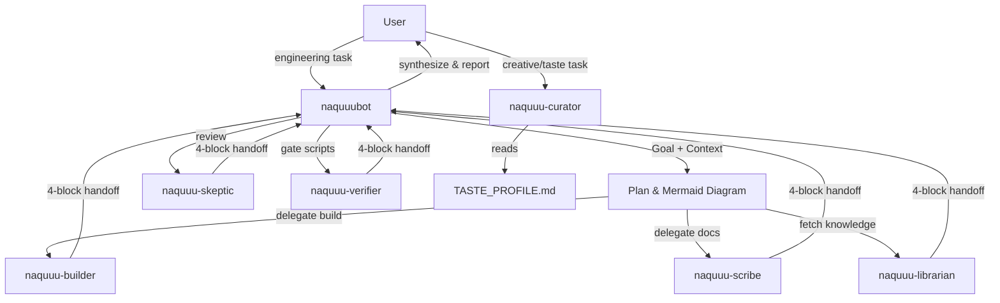

# Architectural Specification: Personal Agent-Subagent Architecture

> **Status**: Locked Plan (final, development-focused) — Phases 1-4 complete.
> **Date**: 2026-09-22
> **ADR**: ADR-011 (to be written as part of Phase 1)

---

## 1. Goal & Context

Adopt the agent-subagent architectural rigor from the MAPCLUB PO Workspace and apply it to the personal engineering workspace (`naquuuu`). This architecture defines strict role separation, structured handoffs, and execution gates, while replacing corporate tools with an aesthetic curation agent tailored to personal hobbies, music, and art.

**Corporate Isolation**: The architectural *pattern* is copied; zero domain content, credentials, or stakeholder names cross over. This is a personal, non-employed workspace (ADR-003).

---

## 2. Core Contracts (Shared by All Agents)

### Four-Block Handoff
Every delegated task returns exactly:
```markdown
### Result
### Files Changed
### Evidence
### Blockers
```

### Universal Prompt Formula
Root agents delegate using:
```text
Goal:        <one sentence outcome>
Context:     <file paths or line ranges, no pastes>
Done when:   <2-3 verifiable criteria>
Constraints: <In-scope / out-of-scope>
Evidence:    Four-block handoff
```

### Persona Precedence
Each agent's persona is defined in `.opencode/agent/<name>.md`. The persona file is the single source of truth for voice, emoji usage, and communication style. `internal-docs/TASTE_PROFILE.md` is the ground truth for aesthetic preferences and is read by agents that need it (primarily `naquuu-curator`). The two entry-point personas also ship as Antigravity custom agents at `.agents/agents/<name>.md` (naquuubot, naquuu-curator only); `.opencode/agent/<name>.md` remains the source of truth, and persona changes must land in both surfaces in the same change (ADR-014). The five hidden subagents remain OpenCode-only.

---

## 3. Agent Roster (7 Agents)

### Primary Agents (User-Facing)

| # | Agent ID | Role | Mode | Permissions |
|---|----------|------|------|-------------|
| 1 | **`naquuubot`** | Chief of Staff / Engineering Orchestrator | `primary` | edit: allow; bash: auto-approve (commit/push ask; destructive deny); external_directory: allow; task: naquuu-* allow |
| 2 | **`naquuu-curator`** | Aesthetic, Taste & Persona Muse | `primary` | edit: deny, bash: deny, task: deny |

### Subagents (Hidden Specialists, Depth = 1)

| # | Agent ID | Role | Mode | Permissions |
|---|----------|------|------|-------------|
| 3 | **`naquuu-builder`** | Software & Prototype Builder | `subagent` | edit: allow, bash: allow, task: deny |
| 4 | **`naquuu-scribe`** | Content & Documentation Scribe | `subagent` | edit: allow, bash: deny, task: deny |
| 5 | **`naquuu-librarian`** | Personal Knowledge Librarian | `subagent` | edit: deny, bash: deny, task: deny |
| 6 | **`naquuu-skeptic`** | Adversarial Reviewer | `subagent` | edit: deny, bash: deny, task: deny |
| 7 | **`naquuu-verifier`** | Quality Gatekeeper | `subagent` | edit: deny, bash: allow, task: deny |

### Author + Reviewer Pairing
- **Authors**: `naquuu-builder`, `naquuu-scribe`
- **Reviewers**: `naquuu-skeptic` (qualitative), `naquuu-verifier` (deterministic gates)
- Max 2 review cycles before human escalation.

---

## 4. Locked Implementation Plan

### Phase 1: Agent Architecture
**Authoring owner**: AGY. **Execution owner**: opencode/deepseek. One writer per file, commit between handoffs.

| # | Artifact | Owner | Notes |
|---|----------|-------|-------|
| 1 | `opencode.jsonc` | AGY / Opus 4.6 | `$schema`, `default_agent: "naquuubot"`, `subagent_depth: 1`, disable explore + general. No model fields, no prompts in JSON. |
| 2 | `.opencode/agent/*.md` ×7 | AGY / Opus 4.6 | Only description, mode, permission. No `model:`, no `variant:`; inherit session model. |
| 3 | `AGENTS.md` patch | AGY / Opus 4.6 | Shared contracts once (four-block, universal prompt, persona precedence), agent column in routing table. |
| 4 | `AGENT_PLAYBOOK.md`, `TASTE_PROFILE.md` | AGY / Sonnet 4.6 | `TASTE_PROFILE` starts as blank template. |
| 5 | `.gitignore` negation | opencode / deepseek | `!.opencode/agent/` so personas are tracked. |
| 6 | `sync_all_repos.py --strict` | opencode / deepseek | Bug: exits 0 even when dirty (line 113). |
| 7 | Sanitizer phone rule | opencode / deepseek | Docstring claims phone scanning (line 11), `FORBIDDEN_RULES` has no phone regex (line 24-45). |
| 8 | ADR-011 | AGY / Sonnet 4.6 | Includes the two-IDE workflow decision; no separate ADR needed. |

**Audit loop**: AGY / Gemini 3.1 Pro High reviews 1-4 read-only against spec, schema, ADR-007/008 canon → NO-GO list → Opus/Sonnet fixes → user commits → opencode takes the tree.

**Verify** (opencode/deepseek): restart opencode → `opencode agent list` shows 7 custom + build/plan, no explore/general → librarian edit denied → nested delegation blocked → one smoke delegation returns a four-block handoff → gate matrix (sanitization hub, sync --strict hub, blog QA in blog/, em-dash grep in blog/) → raw evidence, not summaries → AGY / Gemini 3.8 Flash High spot-checks the diff → user commits.

### Phase 2: Hermes Bare Pipe
opencode/deepseek drives the terminal. User handles number and QR scan privately. Hermes data stays in `%LOCALAPPDATA%\hermes`, outside the hub. Exit check: phone "hello" gets a reply. No commits.

### Phase 3: Thin Relay + Human-Run AGY Handoff (v2, review-driven)
**Policy (ADR-012/ADR-013)**: AGY is strictly human-operated. No agent invokes the `agy` CLI headless, automates the Antigravity UI, or reuses Antigravity credentials. Reviews confirmed the gateway's own shell/code execution is approval-gated and fail-closed; the relay must never widen that path.

**Autonomy override (ADR-016)**: execution is fully autonomous on both surfaces — Hermes approvals `mode=off` with a destructive deny-list, and opencode bash auto-approve plus external file access. The independent-approval language in 3C is superseded; `git commit`/`git push` remain `ask`, and the deny-list is the last mechanical guard.

**3A - Safety basics (before any relay code)**
1. Install `.githooks/pre-commit` + `.githooks/pre-push` and set `core.hooksPath` (pulled forward from Phase 4); pre-push refuses non-fast-forward updates.
2. Model-Input Boundary policy in AGENTS.md Section 3: the sanitizer is a git gate, not a model-input firewall; add a synthetic-secret canary check for relay input paths.
3. Minimal `scripts/host_check.py`: hub tree state, gateway singleton, bridge PID/mode drift, effective-config presence (values never printed).
4. Brief lock convention (`internal-docs/briefs/README.md`): one writer at a time; opencode halts while a brief is active.

**3B - Relay v1 (notification/read-only)**
WhatsApp to Hermes to opencode: status queries, brief creation, and notifications only. Job IDs, sanitized status replies, no shell and no edits from chat.

**3C - Writes (gated, later)**
Per-job branch/worktree, path allowlist, expiry-bound approval through an independent channel (laptop/SSH, not WhatsApp), gates run from a protected copy, builders hold no push credentials.

**3D - Remote AGY (human-run)**
Tailscale mesh. SSH primary: install OpenSSH Server restricted to Tailscale. RDP optional: Windows 10 Pro, enable with firewall scoped to Tailscale, acknowledging it locks the local screen while connected. The owner drives the `agy` interactive TUI.

**3E - Negative tests (bounded)**
"Specified agents/identities lack specified capabilities under this documented threat model", including indirect execution attempts. No claim of absolute prevention.

**Deferred**: separate Windows identity/VM isolation is a Phase 4 panel-review input; provider/local-model choice is Phase 4.

**Privacy decision (ADR-013)**: the owner declines Privacy Mode and accepts free-tier training for Hermes chat content. Hard rule unchanged: keys, credentials, phone numbers, and tokens never enter model context.

**Model roles (reference)**: opencode orchestrator and all subagents inherit the session model (deepseek-v4.1-flash); Hermes uses its configured provider (Nous Portal free, interim); AGY uses the owner-selected Gemini model under the Antigravity subscription.

### Phase 4: Hosting (after Phases 1-3 pass)

**Pre-hosting artifacts** (written on this laptop before any VPS work):

| Artifact | Purpose |
|----------|----------|
| `.githooks/pre-commit` | Runs `verify_sanitization.py`; blocks any commit from any host, human or bot. |
| `.githooks/pre-push` | Same gate plus `git push --force` refused; activated via `core.hooksPath`. |
| `scripts/host_check.py` | Cross-platform: tree clean, single gateway instance, auth present, WA session state; can inspect the remote host over Tailscale. |
| `internal-docs/HOSTS.md` | Topology, bootstrap steps, the switch runbook. |
| `NAQUUUU_WORKSPACE` env var | Removes hardcoded `C:\personal\naquuuu` from agents and the Hermes relay skill; Linux path on the VPS. |

**Execution steps**:
1. Write `HOSTS.md` + `host_check.py` + hooks while still on this laptop; verify hooks block a seeded violation.
2. Provision the VPS: opencode + Hermes, runtime clone, provider auth, `opencode serve` bound to loopback/Tailscale with `OPENCODE_SERVER_PASSWORD`, Hermes gateway under systemd, WA re-paired with the dedicated number.
3. VPS goes primary. Laptop pulls before any local work; `host_check.py` refuses local dev when the VPS tree is dirty or ahead.
4. Home laptop becomes standby: identical bootstrap, no runtime authority until the drill. Run one deliberate failover drill (VPS → laptop and back), then log the result.

**Switch procedure** (VPS → laptop, and back):
1. Stop the gateway on the active host.
2. Ensure its tree is committed and pushed (hooks already guarantee gates).
3. On the standby: pull, run `host_check.py`, start the gateway; re-pair WhatsApp only if the copied session is rejected.
4. Verify with a phone "hello" plus one repo-status question before declaring the switch done.

**Residual risk, stated plainly**: with push allowed from the runtime host, a WhatsApp compromise plus an allowlist mistake equals repo write. Mitigations are the owner allowlist, primary-number-only policy, denied destructive commands (`rm -rf`, `git reset --hard`, force push), and the two hooks. If you later want a harder stop, flip push to deny and push from the laptop after review.

**Phase 4 prerequisite**: Hermes needs its own provider key on the VPS, separate from opencode auth. That stays in the host env, never in the repo.

---

## 5. Standing Rules
1. Commit at every IDE handoff; never two writers on one tree.
2. Tier 1 (number, QR, session creds, keys) never enters any model context in either IDE.
3. Only opencode verifies opencode runtime; Antigravity audits text only.
4. Model pinning and `verify_agent_config.py` are deliberately deferred to a future ADR once the varied provider mix is settled.
5. All paths use `$NAQUUUU_WORKSPACE` (or `%NAQUUUU_WORKSPACE%` on Windows) instead of hardcoded `C:\personal\naquuuu`. Agent persona files, relay skills, and host scripts resolve workspace root from this env var.
6. **AGY is human-operated** (ADR-012): agents never invoke the Antigravity CLI, automate its UI, or reuse its credentials; agents prepare briefs in `internal-docs/briefs/` and Hermes notifies only.

---

## 6. Required File Structure (All Phases)

```
$NAQUUUU_WORKSPACE/
├── opencode.jsonc                         [NEW]   Phase 1  Agent registry & permissions
├── .opencode/agent/                       [NEW]   Phase 1  7 agent persona/instruction files
│   ├── naquuubot.md
│   ├── naquuu-curator.md
│   ├── naquuu-builder.md
│   ├── naquuu-scribe.md
│   ├── naquuu-librarian.md
│   ├── naquuu-skeptic.md
│   └── naquuu-verifier.md
├── .agents/agents/                        [NEW]   Phase 3  AGY custom-agent mirrors (naquuubot, naquuu-curator)
├── .githooks/                             [NEW]   Phase 3  Git hooks (pulled forward from Phase 4)
│   ├── pre-commit                                          Runs verify_sanitization.py
│   └── pre-push                                            Same gate + force-push refused
├── AGENTS.md                              [MODIFY] Phase 1  Add agent orchestration section
├── internal-docs/
│   ├── AGENT_PLAYBOOK.md                  [NEW]   Phase 1  Character sheets & delegation patterns
│   ├── briefs/                            [NEW]   Phase 3  Task briefs for human-run AGY sessions
│   ├── TASTE_PROFILE.md                   [NEW]   Phase 1  Blank template for aesthetic preferences
│   ├── HOSTS.md                           [NEW]   Phase 4  Topology, bootstrap, switch runbook
│   └── DECISION_LOG.md                    [MODIFY] Phase 1  ADR-011 to ADR-014 (append-only)
├── scripts/
│   ├── sync_all_repos.py                  [MODIFY] Phase 1  Fix exit-0-when-dirty + --strict
│   ├── verify_sanitization.py             [MODIFY] Phase 1  Add missing phone regex rule
│   └── host_check.py                      [NEW]   Phase 3 (minimal; expanded in Phase 4)  Cross-platform host readiness
└── .gitignore                             [MODIFY] Phase 1  Add !.opencode/agent/ negation
```

---

## 7. Verified Bugs (Items 6 & 7)

### Bug 1: `sync_all_repos.py` exits 0 when dirty
- **Location**: [`sync_all_repos.py:113`](file:///c:/personal/naquuuu/scripts/sync_all_repos.py#L113)
- **Problem**: `return 0` is unconditional. When `all_clean` is False, the script still returns 0.
- **Fix**: `return 0 if all_clean else 1`
- **Add `--strict` flag**: When passed, exit 1 on any dirty repo.

### Bug 2: Sanitizer missing phone rule
- **Location**: [`verify_sanitization.py:11`](file:///c:/personal/naquuuu/scripts/verify_sanitization.py#L11) claims phone scanning; [`FORBIDDEN_RULES:24-45`](file:///c:/personal/naquuuu/scripts/verify_sanitization.py#L24-L45) has no phone regex.
- **Fix**: Add regex for Indonesian phone numbers (`+62...`, `08xx...`) to `FORBIDDEN_RULES`.

---

## 8. Execution Flow Example



---

## 9. Next Actions (Exit Plan Mode)

| IDE | Stage | What |
|-----|-------|------|
| **AGY** | 1A | Author items 1-4 plus the four forward-compat amendments (`NAQUUUU_WORKSPACE` in persona files, `.githooks` path in standing rules, `HOSTS.md` stub reference in `AGENTS.md`, `host_check.py` mention in gate table). |
| **opencode** | 2A | Begins only after user commits Stage 1D. |
